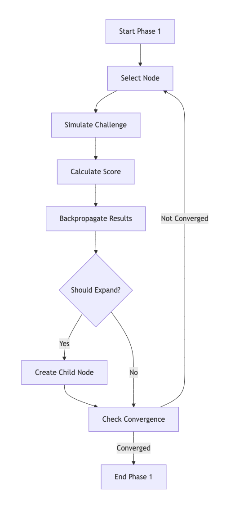
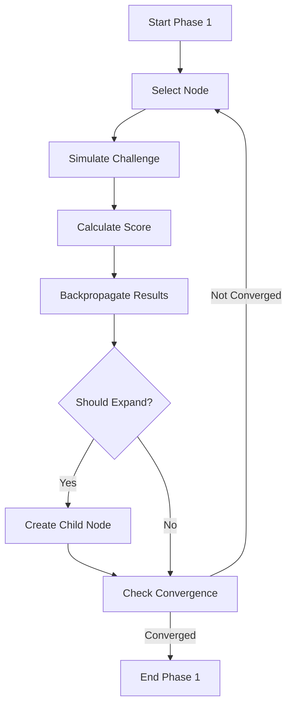
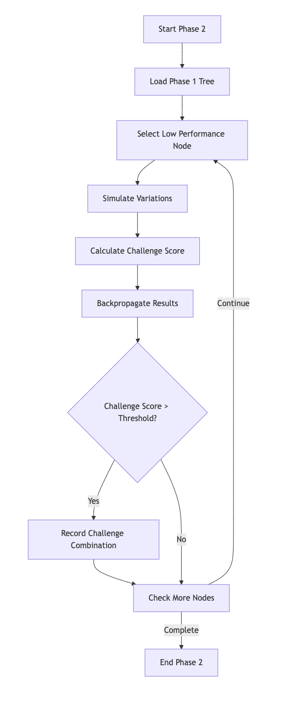
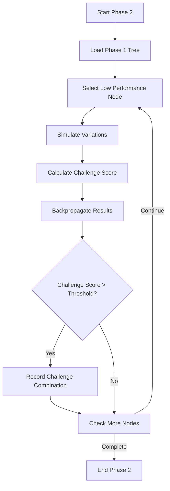
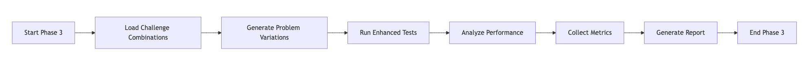

# PrismBench LLM Capability Mapping Framework

[](https://opensource.org/licenses/MIT)
[](https://www.python.org/downloads/)
[](https://platform.openai.com/docs/guides/text-generation)
[](https://docs.llama-api.com/quickstart)
[](https://lmstudio.ai/)
[](https://ollama.com/)


PrismBench is an LLM capability mapping framework designed to assess and understand the strengths and weaknesses of LLM models in computer science problem-solving. The framework operates in three distinct phases, each building upon the previous to provide a comprehensive analysis of the model's capabilities.

## Table of Contents
- [Overview](#overview)
- [Quick Start](#quick-start)
  - [Setting up the environment variables](#setting-up-the-environment-variables)
  - [Selecting the models](#selecting-the-models)
  - [Running the PrismBench Framework](#running-the-prismbench-framework)
- [Program Flow](#program-flow)
- [Monte Carlo Tree Search](#monte-carlo-tree-search-mcts)
  - [Core MCTS Process](#core-mcts-process)
  - [Key Components](#key-components)
- [Phases](#phases)
  - [Phase 1 - Initial Capability Mapping](#phase-1---initial-capability-mapping)
  - [Phase 2 - Challenge Discovery](#phase-2---challenge-discovery)
  - [Phase 3 - Comprehensive Evaluation](#phase-3---comprehensive-evaluation)
- [Configuration Variables](#configuration-variables)
  - [Environment Variables in `configs.yml`](#environment-variables-in-configsyml)
  - [Agent Roles in `agent_config_v7.yml`](#agent-roles-in-agent_config_v7yml)
- [Analysis Pipeline](#analysis-pipeline)

## Overview

PrismBench systematically evaluates an LLM model by generating coding challenges, assessing the model's solutions, and analyzing performance across various computer science concepts and difficulty levels.

## Quick Start

```bash
# Clone the repository
git clone https://github.com/CommissarSilver/PrismBench.git
cd PrismBench

# Create virtual environment (recommended)
python -m venv venv
source venv/bin/activate  # Unix
.\venv\Scripts\activate   # Windows

# Install dependencies
pip install -r requirements.txt
```

### Setting up the environment variables
PrismBench supports benchmarking any model that follows the [OpenAI text generation standard](https://platform.openai.com/docs/guides/text-generation) which is the default standard of communicating with LLMs through APIs. This means that you can use  any model that is hosted through APIs that follow this standard. This also includes local models loaded through `ollama` or `LMstudio`.

To set up the environment variables, you need to create a `.env` file in the root directory of the project. The `.env` file should contain the following variables:

```bash
OPENAI_API_KEY = your_openai_api_key
DEEPSEEK_API_KEY = your_deepseek_api_key
CHATLAMMA_API_KEY = your_chatlamma_api_key
LOCAL = your_custom_api_key # only used for ollama and LMstudio
```

### Selecting the models
To select the model you want to benchmark, you can change the `model` variable in the `afent_configs_v7.yml` file. The default model is `gpt-4o-mini`. Additionally, if you are using a local model, you can change the `model` variable to `local`.

### Running the PrismBench Framework
To run the PrismBench framework, you can use the following command:

```bash
python src/main.py
```


## Program Flow

1. **Initialization**: The environment and tree structures are set up based on the configuration files.
2. **Phase 1 Execution**: The MCTS algorithm maps the model's initial capabilities.
3. **Phase 2 Execution**: The algorithm identifies challenging concept combinations where the model underperforms.
4. **Phase 3 Execution**: A comprehensive evaluation is conducted on the challenging areas.
5. **Results Analysis**: The system compiles performance metrics, error analyses, and actionable insights.

## Monte Carlo Tree Search (MCTS)

Monte Carlo Tree Search (MCTS) is a probabilistic search algorithm that combines tree search principles with random sampling to find optimal decisions. It is particularly effective in domains with large state spaces where traditional exhaustive search is impractical.

### Core MCTS Process
MCTS iteratively builds a search tree through four key steps:

1. **Selection**: Starting from the root, navigate through the tree using a selection policy (like UCB1) that balances exploration and exploitation until reaching a leaf node.

2. **Expansion**: Create one or more child nodes from the selected leaf node to explore new states.

3. **Simulation**: From the new node, perform a "rollout" by simulating random actions until reaching a terminal state or predefined depth.

4. **Backpropagation**: Update the statistics (visits and values) of all nodes along the path from the simulated node back to the root.

### Key Components

Node Statistics:

- Visit count: Times node was traversed
- Value: Aggregated results from simulations
- Children: Available next states

## Phases

### Phase 1 - Initial Capability Mapping

- **Objective**: Understand the model's basic capabilities across different concepts.
- **Process**:
  - Uses a Monte Carlo Tree Search (MCTS) to explore various concepts and difficulties.
  - Simulates challenges to gather performance data.
  - Builds an initial tree structure representing the model's strengths.
- **Outcome**: A broad understanding of the model's performance, highlighting areas of proficiency.




### Phase 1: Initial MCTS
Focuses on broad exploration of concept space:
- Runs until value convergence is achieved
- Node selection uses inverse probability distribution to favor less-explored nodes 
- Score calculation considers:
  - Challenge success/failure
  - Number of tests passed
  - Penalties for failures, errors, and multiple attempts
  - Difficulty level weighting
- Node expansion occurs when:
  - Node value exceeds performance threshold
  - Node depth is below maximum
- Expansion happens by either:
  - Combining with another node to add new concepts
  - Increasing difficulty level
---

### Phase 2 - Challenge Discovery

- **Objective**: Identify areas where the model struggles.
- **Process**:
  - Takes the Phase 1 tree as input.
  - Focuses on nodes where performance is below a certain threshold.
  - Explores combinations of concepts that are challenging for the model.
- **Outcome**: A collection of challenging concept combinations for further analysis.




### Phase 2: Concept MCTS 
Focuses on finding challenging concept combinations:
- Uses UCB (Upper Confidence Bound) with challenge metrics
- Challenge score calculation considers:
  - Inverse success rate
  - Number of attempts needed
  - Whether fixes were required
- Node expansion prioritizes:
  - Combinations exceeding challenge threshold
  - Increasing difficulty for challenging nodes
  - Adding new concepts for non-challenging nodes
- Maintains a record of challenging combinations with their scores

---

### Phase 3 - Comprehensive Evaluation

- **Objective**: Deeply understand the model's challenges.
- **Process**:
  - Generates multiple variations of challenging problems identified in Phase 2.
  - Runs extensive testing using an enhanced environment.
  - Collects detailed performance data.
- **Outcome**: In-depth insights into the model's weaknesses, ready for detailed analysis.

    


### Phase 3: Comprehensive MCTS
Focuses on detailed evaluation of challenging areas:
- Takes challenging nodes identified in Phase 2
- Generates multiple problem variations per concept combination
- Records detailed challenge descriptions and results
- Maintains full history of:
  - Problem statements
  - Solution attempts
  - Test cases
  - Performance metrics

## Configuration Variables

Configuration variables are defined in `agent_config_v7.yml` and `configs.yml`. They control various aspects of the system's behavior.

### Environment Variables in `configs.yml`:

- **Global Constants**:
  - `max_attempts`: Maximum number of attempts the model has to solve a challenge.
  - `discount_factor`: Discount factor used in backpropagation during MCTS.
  - `learning_rate`: Learning rate for updating node values.

- **Phase 1 Settings**:
  - `performance_threshold`: Minimum node value to consider for expansion.
  - `value_delta_threshold`: Threshold to determine convergence based on value changes.
  - `convergence_checks`: Number of iterations to confirm convergence.
  - `exploration_probability`: Probability of exploring new nodes randomly.

- **Scoring Parameters**:
  - `penalty_per_failure`: Penalty for each failed test.
  - `penalty_per_error`: Penalty for each error encountered.
  - `penalty_per_attempt`: Penalty for each additional attempt after the first.
  - `fixed_by_problem_fixer_penalty`: Additional penalty if the solution needed fixing.

- **Phase 2 Settings**:
  - `challenge_threshold`: Threshold to consider a concept combination challenging.
  - `convergence_checks`: Number of iterations to confirm convergence.
  - `value_delta_threshold`: Threshold to determine convergence based on value changes.
  - `exploration_weight`: Weight given to exploration in UCB calculation.
  - `exploration_probability`: Probability of exploring new nodes in Phase 2.

- **Phase 3 Settings**:
  - `variations_per_concept`: Number of variations to generate per concept combination.
  - `node_selection_threshold`: Threshold for selecting nodes based on challenge score.

### Agent Roles in `agent_config_v7.yml`

Agents define specialized roles for generating prompts and processing responses.

- **challenge_designer**:
  - **Role**: Creates coding challenges focused on specific CS concepts and difficulty levels.
  - **Template**: Designs problems similar to LeetCode challenges, ensuring they match the specified concept and difficulty.

- **challenge_designer_advanced**:
  - **Role**: Generates new and unique coding challenges, avoiding duplication.
  - **Template**: Ensures problems are substantially different from previous ones while maintaining the same concepts.

- **test_generator**:
  - **Role**: Develops comprehensive unittest test cases for coding problems.
  - **Template**: Creates test suites covering a range of scenarios from very easy to very hard.

- **problem_solver**:
  - **Role**: Implements efficient and well-structured solutions to coding problems.
  - **Template**: Provides a single Python function named `solution` that adheres to problem specifications.

- **problem_fixer**:
  - **Role**: Analyzes failing solutions to identify issues and provides corrections.
  - **Template**: Offers a corrected version of the code enclosed within specific delimiters.

- **test_validator**:
  - **Role**: Validates test cases to ensure they properly verify problem requirements.
  - **Template**: Checks for coverage, correctness, and adherence to best practices.

- **test_error_analyzer**:
  - **Role**: Analyzes test execution outputs to provide insights into failures.
  - **Template**: Identifies failed tests, analyzes errors, and suggests areas for investigation.

- **solution_pattern_analyzer**:
  - **Role**: Reviews solution code to identify patterns and implementation approaches.
  - **Template**: Provides a structured JSON report highlighting algorithm choices, data structures, and coding patterns.

## Analysis Pipeline
Once the benchmarking is finished after running `src/main.py`, the terminal will display:

```bash
MCTS Phase 3 completed
```
Afterwards, the entire analysis pipeline can be run with the following command:

```bash
python src/phase_one_report.py
```

This will provide analysis on the metrics outlined in [Benchmark Metrics](/benchmark_metrics.md). The results will be available in full JSON files alongside charts that visualize the model's performance for each of the described metrics. The structure of the JSON files in outlined in [Comparative Analysis](/comparative%20analysis.md). 
