# Architecture Overview

This document provides a comprehensive overview of PrismBench's architecture, design principles, and component interactions.

## System Architecture

PrismBench follows a **microservices architecture** pattern, designed for scalability, modularity, and extensibility. The system consists of three core services that communicate via REST APIs.

### High-Level Architecture

```mermaid
graph TB
    subgraph "PrismBench Framework"
        subgraph "Core Services"
            Search[Search Service<br/>🔍 MCTS Engine<br/>Port 8002]
            Environment[Environment Service<br/>🌍 Challenge Execution<br/>Port 8001]
            LLM[LLM Interface Service<br/>🤖 Model Communication<br/>Port 8000]
        end
        
        subgraph "Data Layer"
            Redis[Redis<br/>🗄️ Session Storage]
            FileSystem[File System<br/>📁 Results & Logs]
        end
        
        Search <--> Environment
        Environment <--> LLM
        LLM <--> Redis
        Search --> FileSystem
    end
    
    subgraph "External Services"
        OpenAI[OpenAI API]
        Anthropic[Anthropic API]
        DeepSeek[DeepSeek API]
        Local[Local Models<br/>ollama/LMstudio]
    end
    
    LLM <--> OpenAI
    LLM <--> Anthropic
    LLM <--> DeepSeek
    LLM <--> Local
```



## Core Services

### Search Service (Port 8002)

**Purpose**: Orchestrates the Monte Carlo Tree Search algorithm and manages evaluation phases.

**Key Responsibilities**:
- MCTS algorithm execution across multiple phases
- Tree structure management and traversal
- Node selection, expansion, and evaluation orchestration
- Session management for search experiments
- Task coordination and progress tracking

**Key Components**:
- **Phase Registry**: Pluggable phase strategy system
- **MCTS Service**: Core algorithm implementation
- **Tree Framework**: Search tree data structures
- **Session Management**: Experiment lifecycle management

### Environment Service (Port 8001)

**Purpose**: Executes coding challenges and manages the agent-based evaluation workflow.

**Key Responsibilities**:
- Challenge generation through specialized agents
- Test case creation and validation
- Solution generation and debugging
- Code execution in isolated environments
- Multi-agent workflow orchestration

**Key Components**:
- **Environment Registry**: Pluggable environment implementations
- **Agent Orchestration**: Multi-agent workflow management
- **Code Execution**: Isolated Python execution environment
- **Challenge Management**: Problem generation and evaluation

### LLM Interface Service (Port 8000)

**Purpose**: Provides unified access to multiple LLM providers and manages agent interactions.

**Key Responsibilities**:
- Multi-provider LLM abstraction
- Session-based conversation management
- Asynchronous request processing
- Agent role and prompt management
- Response parsing and formatting

**Key Components**:
- **Provider Abstraction**: Unified interface for multiple LLM APIs
- **Session Management**: Multi-turn conversation handling
- **Agent Framework**: Role-based prompt management
- **Task Processing**: Asynchronous request handling

## Design Principles

### 1. Modularity
Each service is independently deployable and scalable. Services communicate only through well-defined REST APIs, allowing for:
- Independent development and testing
- Technology stack flexibility
- Horizontal scaling of individual components
- Easy replacement or enhancement of services

### 2. Extensibility
The framework supports extension at multiple levels:
- **Pluggable Agents**: Add new agent types without code changes
- **Custom Environments**: Implement domain-specific evaluation environments
- **Phase Strategies**: Create new MCTS phases with different objectives
- **Model Providers**: Integrate new LLM providers seamlessly

### 3. Asynchronous Processing
All services are built with async-first design:
- Non-blocking operations for better resource utilization
- Concurrent processing of multiple evaluations
- Task-based processing with status tracking
- Event-driven communication patterns

### 4. Configuration-Driven
Behavior is controlled through external configuration:
- YAML-based configuration files
- Runtime parameter adjustment
- Environment-specific settings
- Agent role definitions

## Component Deep Dive

### Search Tree Structure

The search tree is the core data structure representing the exploration space:

```python
class ChallengeNode:
    """Represents a node in the MCTS tree"""
    def __init__(self, concepts: List[str], difficulty: str):
        self.concepts = concepts           # CS concepts tested
        self.difficulty = difficulty       # Difficulty level
        self.visits = 0                   # MCTS visit count
        self.value = 0.0                  # Average performance score
        self.children = []                # Child nodes
        self.parent = None                # Parent node
        self.phase = 1                    # Which phase created this node
        self.run_results = []             # Historical evaluation results
```

**Tree Growth Pattern**:
- **Root nodes**: Single concepts at various difficulties
- **Child nodes**: Concept combinations or difficulty progressions
- **Leaf nodes**: Unexplored combinations awaiting evaluation

### Agent System Architecture

The agent system provides specialized AI assistants for different tasks:

```mermaid
graph LR
    subgraph "Agent Workflow"
        CD[Challenge Designer<br/>📝 Problem Creation]
        TG[Test Generator<br/>🧪 Test Cases]
        PS[Problem Solver<br/>💡 Solutions]
        PF[Problem Fixer<br/>🔧 Debugging]
        
        CD --> TG
        TG --> PS
        PS --> PF
    end
    
    subgraph "Enhanced Workflow"
        CDA[Challenge Designer Advanced<br/>📝 Diverse Problems]
        TV[Test Validator<br/>✅ Quality Assurance]
        TEA[Test Error Analyzer<br/>🔍 Failure Analysis]
        
        CDA --> TV
        PS --> TEA
    end
```



### Environment Registry Pattern

The environment registry enables pluggable evaluation strategies:

```python
@environment_registry.register_environment_method("custom_env", "execute_node")
async def execute_node(self: "BaseEnvironment", **kwargs) -> Dict:
    """Custom environment execution logic"""
    # Environment-specific implementation
    pass
```

This pattern allows:
- Runtime environment discovery
- Zero-configuration environment loading
- Polymorphic environment behavior
- Easy testing and development

### Phase Registry Pattern

Similar pattern for MCTS phases:

```python
@phase_registry.register_phase_method("phase_1", "select_node")
async def select_node(self: "BasePhase") -> ChallengeNode:
    """Phase-specific node selection strategy"""
    # Selection algorithm implementation
    pass
```

## Data Flow

### 1. Evaluation Request Flow


### 2. Agent Interaction Flow


## Error Handling Strategy

### Service Level
- Graceful degradation on service failures
- Comprehensive logging and monitoring

### Data Level
- Input validation at all service boundaries
- Rollback capabilities for failed operations
- Data consistency checks

## Configuration Management

### Configuration Hierarchy
1. **Default configurations**: Built-in sensible defaults
2. **Environment-specific**: Development, staging, production

### Configuration Categories
- **Service configuration**: Port, host, logging levels
- **Algorithm parameters**: MCTS settings, convergence thresholds
- **Agent definitions**: Prompts, models, parameters
- **Environment setup**: Available environments and their agents

---

## Related Pages

### 🧠 **Core Components**
- [🤖 Agent System](Agent-System) - Deep dive into the agent architecture
- [🌍 Environment System](Environment-System) - Environment framework details
- [🌳 Tree Structure](Tree-Structure) - Search tree implementation
- [🌳 MCTS Algorithm](MCTS-Algorithm) - Monte Carlo Tree Search details

### ⚙️ **Configuration & Setup**
- [📋 Configuration Overview](Configuration-Overview) - Configuration system details
- [⚡ Quick Start](Quick-Start) - Getting started guide
- [🆘 Troubleshooting](Troubleshooting) - Common issues and solutions

### 🛠️ **Extensions**
- [🔧 Extending PrismBench](Extending-PrismBench) - Framework extensibility
- [🧩 Custom Agents](Custom-Agents) - Creating custom agents
- [🌐 Custom Environments](Custom-Environments) - Building custom environments
- [🔍 Custom MCTS Phases](Custom-MCTS-Phases) - Implementing search strategies 