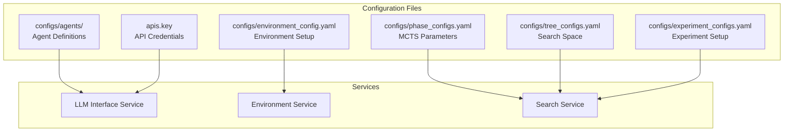

# Configuration Overview

PrismBench uses a comprehensive configuration system based on YAML files to control every aspect of the framework's behavior. This document provides an overview of all configuration files and their purposes.

## Configuration Architecture



## Configuration Files Overview

| File | Purpose | Service | Description |
|------|---------|---------|-------------|
| `configs/agents/*.yml` | Agent Definitions | LLM Interface | Individual agent role configurations |
| `configs/environment_config.yaml` | Environment Setup | Environment | Available environments and their agents |
| `configs/phase_configs.yaml` | MCTS Parameters | Search | Phase-specific algorithm parameters |
| `configs/tree_configs.yaml` | Search Space | Search | Concepts and difficulties to explore |
| `configs/experiment_configs.yaml` | Experiment Setup | Search | Experiment configuration and phase sequences |
| `apis.key` | API Credentials | LLM Interface | API keys for LLM providers |

## 1. Agent Configurations (`configs/agents/*.yml`)

Agent configurations define the behavior, prompts, and model settings for each specialized agent.

### Purpose
- Define agent roles and responsibilities
- Configure model parameters (temperature, max_tokens, etc.)
- Set up prompt templates and interaction patterns
- Specify output formatting requirements

### File Structure
```yaml
agent_name: challenge_designer
configs:
  model_name: gpt-4o-mini
  provider: openai
  params:
    temperature: 0.8
    max_tokens: 5120
  local: false
system_prompt: >
  You are an expert computer science educator...
interaction_templates:
  - name: basic
    required_keys: [concepts, difficulty_level]
    template: >
      Generate a coding problem for: {concepts}...
    output_format:
      response_begin: <problem_description>
      response_end: </problem_description>
```

### Key Sections

#### Agent Identity
- `agent_name`: Unique identifier for the agent
- Used throughout the framework to reference this agent

#### Model Configuration
- `model_name`: Specific model to use (e.g., "gpt-4o-mini")
- `provider`: LLM provider ("openai", "anthropic", "deepseek", etc.)
- `params`: Model-specific parameters
  - `temperature`: Creativity level (0.0-1.0)
  - `max_tokens`: Maximum response length
- `local`: Whether this is a local model

#### Prompt Engineering
- `system_prompt`: Core instructions defining the agent's role
- Defines expertise, behavior patterns, and output requirements
- Critical for consistent agent performance

#### Interaction Templates
- `name`: Template identifier
- `required_keys`: Input parameters needed
- `template`: Formatted prompt template with placeholders
- `output_format`: Expected response delimiters

### Available Agents

| Agent | Purpose | Key Features |
|-------|---------|--------------|
| `challenge_designer` | Creates coding problems | Problem generation, difficulty scaling |
| `challenge_designer_advanced` | Creates diverse problems | Duplicate avoidance, variation generation |
| `test_generator` | Develops test cases | Comprehensive testing, edge cases |
| `test_validator` | Validates test quality | Test coverage analysis, quality assurance |
| `problem_solver` | Implements solutions | Algorithm implementation, code generation |
| `problem_fixer` | Debugs failing code | Error analysis, code repair |
| `test_error_analyzer` | Analyzes test failures | Failure categorization, root cause analysis |
| `solution_pattern_analyzer` | Analyzes code patterns | Pattern recognition, complexity analysis |

## 2. Environment Configurations (`configs/environment_config.yaml`)

Defines available execution environments and their agent compositions.

### Purpose
- Configure available evaluation environments
- Define agent teams for different environment types
- Set environment-specific parameters
- Control resource allocation and timeouts

### File Structure
```yaml
environment_coding_challenge:
  agents:
    - "challenge_designer"
    - "test_generator"
    - "problem_solver"
    - "problem_fixer"
  max_attempts: 3
  timeout: 300
  num_problems: 1

environment_enhanced_coding_challenge:
  agents:
    - "challenge_designer_advanced"
    - "test_generator"
    - "problem_solver"
    - "problem_fixer"
    - "test_validator"
    - "test_error_analyzer"
  max_attempts: 3
  timeout: 600
  num_problems: 5
```

### Configuration Parameters

| Parameter | Type | Purpose | Default |
|-----------|------|---------|---------|
| `agents` | List[str] | Agent names for this environment | Required |
| `max_attempts` | int | Maximum solution attempts per problem | 3 |
| `timeout` | int | Request timeout in seconds | 300 |
| `num_problems` | int | Number of problems to generate | 1 |

### Environment Types

#### Standard Coding Challenge
- Basic four-agent workflow
- Single problem per evaluation
- Standard timeout settings
- Good for baseline evaluations

#### Enhanced Coding Challenge
- Extended six-agent workflow
- Multiple problems per evaluation
- Additional validation and analysis
- Comprehensive evaluation mode

## 3. Phase Configurations (`configs/phase_configs.yaml`)

Contains detailed parameters for each MCTS phase, controlling algorithm behavior and convergence criteria.

### Purpose
- Configure MCTS algorithm parameters
- Define phase-specific objectives and strategies
- Set convergence criteria and exploration policies
- Control scoring and evaluation methods

### File Structure
```yaml
phase_1:
  phase_params:
    max_depth: 5
    max_iterations: 100
    performance_threshold: 0.4
    value_delta_threshold: 0.3
    convergence_checks: 10
    exploration_probability: 0.25
    num_nodes_per_iteration: 5
  
  search_params:
    max_attempts: 3
    discount_factor: 0.9
    learning_rate: 0.9
  
  scoring_params:
    penalty_per_failure: 2
    penalty_per_error: 3
    penalty_per_attempt: 1
    fixed_by_problem_fixer_penalty: 5
    max_num_passed: 10
  
  environment:
    name: 'environment_coding_challenge'
```

### Parameter Categories

#### Phase Parameters
Control the core MCTS algorithm behavior:

| Parameter | Purpose | Impact |
|-----------|---------|--------|
| `max_depth` | Maximum tree depth | Prevents infinite expansion |
| `max_iterations` | Maximum algorithm iterations | Controls runtime |
| `performance_threshold` | Node expansion threshold | Higher = more conservative |
| `value_delta_threshold` | Convergence detection | Higher = easier convergence |
| `convergence_checks` | Stable iterations needed | Higher = more confidence |
| `exploration_probability` | Random exploration rate | Higher = more exploration |
| `num_nodes_per_iteration` | Concurrent evaluations | Higher = faster but more resources |

#### Search Parameters
Control the learning and value updating:

| Parameter | Purpose | Range |
|-----------|---------|-------|
| `max_attempts` | Solution attempts per problem | 1-10 |
| `discount_factor` | Future reward discounting | 0.0-1.0 |
| `learning_rate` | New vs old value weighting | 0.0-1.0 |

#### Scoring Parameters
Define how performance is calculated:

| Parameter | Purpose | Impact |
|-----------|---------|--------|
| `penalty_per_failure` | Test failure penalty | Higher = harsher scoring |
| `penalty_per_error` | Runtime error penalty | Higher = error intolerance |
| `penalty_per_attempt` | Multiple attempt penalty | Higher = efficiency emphasis |
| `fixed_by_problem_fixer_penalty` | Fixing needed penalty | Higher = correctness emphasis |
| `max_num_passed` | Maximum tests contributing to score | Caps score inflation |

### Phase-Specific Strategies

#### Phase 1: Capability Mapping
- Lower performance threshold for broader exploration
- Higher convergence checks for thorough evaluation
- Standard environment for baseline assessment

#### Phase 2: Challenge Discovery
- Higher challenge threshold for difficulty identification
- UCB exploration weight for balanced search
- Focus on identifying problematic areas

#### Phase 3: Comprehensive Evaluation
- Enhanced environment for detailed analysis
- Variation generation for thorough testing
- Node selection threshold for quality focus

## 4. Tree Configuration (`configs/tree_configs.yaml`)

Defines the search space dimensions and available exploration targets.

### Purpose
- Define available CS concepts for testing
- Set difficulty levels and progression
- Control search space size and scope
- Enable domain-specific customization

### File Structure
```yaml
tree_configs:
  concepts:
    - loops
    - conditionals
    - functions
    - data_structures
    - algorithms
    - error_handling
    - recursion
    - sorting
    - searching
    - dynamic_programming

  difficulties:
    - very easy
    - easy
    - medium
    - hard
    - very hard
```

### Configuration Elements

#### Concepts
Define the CS topics to evaluate:
- **Basic concepts**: loops, conditionals, functions
- **Data structures**: arrays, lists, trees, graphs
- **Algorithms**: sorting, searching, graph algorithms
- **Advanced topics**: dynamic programming, recursion

#### Difficulties
Progressive difficulty levels:
- **Very Easy**: Basic syntax and simple operations
- **Easy**: Common patterns and straightforward logic
- **Medium**: Multiple concepts and edge cases
- **Hard**: Complex algorithms and optimization
- **Very Hard**: Advanced techniques and corner cases

### Customization Options

#### Domain-Specific Concepts
```yaml
concepts:
  - machine_learning
  - neural_networks
  - computer_vision
  - natural_language_processing
```

#### Custom Difficulties
```yaml
difficulties:
  - beginner
  - intermediate
  - advanced
  - expert
  - research_level
```

## 5. Experiment Configuration (`configs/experiment_configs.yaml`)

Defines experiment parameters and phase execution sequences.

### Purpose
- Configure experiment metadata
- Define phase execution order
- Set up experiment variations
- Control experimental workflow

### File Structure
```yaml
name: "default"
description: "Default experiment configuration"

phase_sequences:
  - phase_1
  - phase_2
  - phase_3
```

### Configuration Options

#### Experiment Metadata
- `name`: Experiment identifier
- `description`: Human-readable description
- `version`: Experiment version for tracking

#### Phase Sequences
- Order of phase execution
- Flexible sequencing for different objectives
- Support for custom phase combinations

### Custom Experiments

#### Capability-Only Evaluation
```yaml
name: "capability_only"
phase_sequences:
  - phase_1
```

#### Challenge-Focused Evaluation
```yaml
name: "challenge_focus"
phase_sequences:
  - phase_1
  - phase_2
```

## 6. API Credentials (`apis.key`)

Stores authentication credentials for LLM providers.

### Purpose
- Secure API key storage
- Multi-provider authentication
- Local model configuration
- Environment isolation

### File Format
```bash
OPENAI_API_KEY = sk-your-openai-key-here
ANTHROPIC_API_KEY = your-anthropic-key-here
DEEPSEEK_API_KEY = your-deepseek-key-here
CHATLAMMA_API_KEY = your-chatlamma-key-here
LOCAL = your-local-api-key-or-token
```

### Supported Providers

| Provider | Key Format | Usage |
|----------|------------|-------|
| OpenAI | `sk-...` | GPT models |
| Anthropic | `ant-...` | Claude models |
| DeepSeek | Custom | DeepSeek models |
| Local | Custom | ollama/LMstudio |


## Configuration Validation

### Automatic Validation
The framework includes built-in validation for:
- Required configuration fields
- Agent existence verification
- Model availability checking

### Manual Validation
Recommended checks:
- API key validity
- Model access permissions
- Resource allocation limits
- Network connectivity

---

**Next Steps:**
- [🤖 Agent Configurations](config-agents.md) - Detailed agent configuration guide
- [🌍 Environment Configurations](config-environments.md) - Environment setup details
- [🔍 Phase Configurations](config-phases.md) - MCTS parameter tuning
- [🌳 Tree Configurations](config-tree.md) - Search space configuration

---

## Related Pages

### ⚙️ **Configuration Guides**
- [🤖 Agent System](Agent-System) - Understanding agent configuration
- [🌍 Environment System](Environment-System) - Environment configuration details
- [🧩 Custom Agents](Custom-Agents) - Creating custom agent configurations
- [🌐 Custom Environments](Custom-Environments) - Building custom environment configs

### 🚀 **Getting Started**
- [⚡ Quick Start](Quick-Start) - Basic configuration setup
- [🏗️ Architecture Overview](Architecture-Overview) - System design and components
- [🆘 Troubleshooting](Troubleshooting) - Configuration-related issues

### 🛠️ **Advanced Configuration**
- [🔍 Custom MCTS Phases](Custom-MCTS-Phases) - Phase configuration parameters
- [🔗 Extension Combinations](Extension-Combinations) - Configuring complex setups
- [🔧 Extending PrismBench](Extending-PrismBench) - Framework extension configuration 