# Environment System

The Environment System provides the execution context for coding challenges and orchestrates multi-agent workflows. It serves as the bridge between the MCTS search algorithm and the actual evaluation of LLM capabilities through structured, reproducible challenges.

## Environment Architecture

### Overview

Environments are **pluggable evaluation strategies** that define how coding challenges are executed, which agents participate, and how results are interpreted. Each environment encapsulates a complete workflow from problem generation to solution evaluation.

```mermaid
graph TB
    subgraph "Environment Framework"
        subgraph "Core Components"
            BE[BaseEnvironment<br/>🏗️ Foundation]
            ER[Environment Registry<br/>📋 Discovery]
            ES[Environment Service<br/>⚡ Orchestration]
        end
        
        subgraph "Built-in Environments"
            ECC[Standard Coding Challenge<br/>📝 Basic Workflow]
            EECC[Enhanced Coding Challenge<br/>🚀 Advanced Workflow]
        end
        
        subgraph "Agent Integration"
            AM[Agent Manager<br/>🤖 Lifecycle]
            IC[Interface Client<br/>🔌 Communication]
        end
    end
    
    subgraph "External Systems"
        LLM[LLM Interface Service]
        Search[Search Service]
    end
    
    ES --> BE
    BE --> ER
    BE --> AM
    AM --> IC
    IC --> LLM
    Search --> ES
```



### Design Principles

#### 1. **Pluggability**
- Runtime environment discovery through registry pattern
- Zero-configuration environment loading
- Decorator-based registration system
- Polymorphic environment behavior

#### 2. **Isolation**
- Independent execution contexts
- Secure code execution environments
- Resource management and cleanup
- Process isolation for safety

#### 3. **Orchestration**
- Multi-agent workflow coordination
- Sequential and parallel processing
- Error handling and recovery
- Result aggregation and analysis

#### 4. **Extensibility**
- Custom environment implementations
- Domain-specific evaluation strategies
- Flexible agent compositions
- Configurable parameters

## Environment Types

### 1. Standard Coding Challenge (`environment_coding_challenge`)

**Purpose**: Basic four-agent workflow for standard coding evaluations.

**Agent Composition**:
- `challenge_designer`: Creates coding problems
- `test_generator`: Develops test cases
- `problem_solver`: Implements solutions
- `problem_fixer`: Debugs failing code

**Workflow Characteristics**:
- Single problem per execution
- Linear agent pipeline
- Basic error handling
- Standard timeout settings

**Configuration**:
```yaml
environment_coding_challenge:
  agents:
    - "challenge_designer"
    - "test_generator"
    - "problem_solver"
    - "problem_fixer"
  max_attempts: 3
  timeout: 300
  num_problems: 1
```

**Execution Flow**:


**Result Structure**:
```json
{
  "success": true,
  "data_trail": [
    {
      "attempt_num": 0,
      "problem_statement": "Write a function that...",
      "test_cases": "import unittest...",
      "solution_code": "def solution()...",
      "tests_passed_num": 5,
      "tests_failed_num": 0,
      "tests_errored_num": 0,
      "success": true,
      "output": "All tests passed."
    }
  ]
}
```

### 2. Enhanced Coding Challenge (`environment_enhanced_coding_challenge`)

**Purpose**: Advanced six-agent workflow with validation and analysis.

**Agent Composition**:
- `challenge_designer_advanced`: Creates diverse, unique problems
- `test_generator`: Develops comprehensive test cases
- `test_validator`: Validates test quality and coverage
- `problem_solver`: Implements solutions
- `problem_fixer`: Debugs failing code
- `test_error_analyzer`: Analyzes failure patterns

**Advanced Features**:
- Multiple problems per execution (configurable)
- Test quality validation
- Duplicate problem avoidance
- Enhanced error analysis
- Comprehensive reporting

**Configuration**:
```yaml
environment_enhanced_coding_challenge:
  agents:
    - "challenge_designer_advanced"
    - "test_generator"
    - "test_validator"
    - "problem_solver"
    - "problem_fixer"
    - "test_error_analyzer"
  max_attempts: 3
  timeout: 600
  num_problems: 5
```

**Extended Workflow**:


## Environment Registry System

### Registration Pattern

Environments use a decorator-based registry for method discovery:

```python
from src.environment.environment_registry import environment_registry

@environment_registry.register_environment_method(
    "custom_environment",
    "execute_node"
)
async def execute_node(self: "BaseEnvironment", **kwargs) -> Dict:
    """Custom environment execution logic"""
    if not self._initialized:
        await self.initialize()
    
    # Custom evaluation workflow
    results = await self._run_custom_workflow(**kwargs)
    
    return {"success": True, "data": results}
```

### Method Registration

The registry supports multiple method types:

| Method | Purpose | Required |
|--------|---------|----------|
| `execute_node` | Core evaluation logic | ✅ |
| `initialize` | Environment setup | ❌ |
| `reset` | Cleanup and reset | ❌ |
| `validate_config` | Configuration validation | ❌ |

### Dynamic Discovery

The registry automatically discovers environment modules:

```python
# Automatic discovery in environment/ directory
    def discover_environments(self, environments_directory: Optional[str] = None) -> List[str]:
        """
        Discover all environment modules in the specified directory.

        Args:
            environments_directory (Optional[str]): Optional custom directory for environment modules

        Returns:
            List[str]: List of discovered environment module names
        """
        if environments_directory is None:
            # default to the directory containing this file
            environments_directory = Path(__file__).parent
        else:
            environments_directory = Path(environments_directory)

        discovered_environments = []

        # look for environment_*.py files
        for file_path in environments_directory.glob("environment_*.py"):
            if "environment_registry.py" in file_path.name:
                continue
            if file_path.is_file() and not file_path.name.startswith("__"):
                module_name = file_path.stem
                discovered_environments.append(module_name)

        logger.info(f"Discovered environments: {discovered_environments}")
        return discovered_environments
```

## BaseEnvironment Class

### Core Functionality

The `BaseEnvironment` class provides foundational services:

```python
class BaseEnvironment:
    def __init__(self, environment_name: str, **kwargs):
        self.environment_name = environment_name
        self.config = self._load_config()
        self.agents = {}
        self._initialized = False
        self.output_dir = self._create_temp_dir()
    
    async def initialize(self) -> None:
        """Initialize agents and resources"""
        await self._initialize_agents()
        self._initialized = True
    
    async def execute_node(self, **kwargs) -> Dict:
        """Override in specific environments"""
        raise NotImplementedError
    
    async def reset(self) -> None:
        """Cleanup resources"""
        await self._cleanup_temp_files()
        await self._reset_agents()
```

### Agent Management

Automatic agent lifecycle management:

```python
async def _initialize_agents(self):
    """Initialize all configured agents"""
    for agent_name in self.config["agents"]:
        session_id = await self.interface_client.initialize_session(
            role=agent_name
        )
        self.agents[agent_name] = {
            "session_id": session_id,
            "initialized": True
        }

async def _reset_agents(self):
    """Reset all agent sessions"""
    for agent_name, agent_info in self.agents.items():
        if agent_info.get("session_id"):
            await self.interface_client.cleanup_session(
                agent_info["session_id"]
            )
```

### Code Execution

Safe code execution within container:

```python
def run_script(script_path: str) -> Tuple[bool, str]:
    """
    Run a Python script and capture its output.

    Args:
        script_path (str): Path to the script to run

    Returns:
        Tuple[bool, str]: Success status and output/error message
    """
    try:
        result = subprocess.run(
            ["python", script_path],
            capture_output=True,
            text=True,
            check=False,
        )

        if result.returncode == 0:
            return True, result.stdout or "All tests passed."
        else:
            return False, result.stderr or result.stdout

    except Exception as e:
        logger.error(f"Error running script: {e}")
        return False, str(e)
```

## Agent Integration

### Interface Client

Communication with LLM Interface Service:

```python
async def interact(self, **kwargs) -> Optional[str]:
        """
        Interact with the LLM service.

        Args:
            **kwargs: Input data for the interaction

        Returns:
            Optional[str]: Response from the LLM
        """
        if not self._initialized:
            await self.initialize()

        try:
            async with httpx.AsyncClient(timeout=self.timeout) as client:
                # Start the interaction
                logger.info(f"Interacting with {self.role} with {kwargs} - {self.session_id}")
                response = await client.post(
                    f"{self.base_url}/interact",
                    json={
                        "session_id": self.session_id,
                        "input_data": kwargs,
                        "use_agent": False,
                    },
                )
                response.raise_for_status()
                data = response.json()
                task_id = data.get("task_id")

                # Poll for results
                while True:
                    await asyncio.sleep(0.5)  # Wait before checking status
                    status_response = await client.get(f"{self.base_url}/task_status/{task_id}")
                    logger.info(f"Status response: {status_response}")
                    status_response.raise_for_status()
                    status_data = status_response.json()

                    if status_data["status"] == "completed":
                        return status_data["result"]["response"]
                    elif status_data["status"] == "failed":
                        logger.error(f"Task failed: {status_data.get('error')}")
                        return None

        except Exception as e:
            logger.opt(exception=e).error(f"Error in LLM interaction: {e}")
            return None
```

### Agent Workflow Coordination

Sequential and parallel agent execution:

```python
async def _run_agent_sequence(self, workflow_steps: List[Dict]) -> Dict:
    """Execute agents in sequence with data passing"""
    context = {}
    
    for step in workflow_steps:
        agent_name = step["agent"]
        input_template = step["input_template"]
        
        # Format input with previous context
        formatted_input = self._format_template(input_template, context)
        
        # Execute agent
        result = await self._execute_agent(agent_name, formatted_input)
        
        # Update context with result
        context[step["output_key"]] = result
    
    return context

async def _run_parallel_agents(self, parallel_tasks: List[Dict]) -> Dict:
    """Execute multiple agents concurrently"""
    tasks = []
    for task in parallel_tasks:
        agent_task = self._execute_agent(
            task["agent"],
            task["input_data"]
        )
        tasks.append(agent_task)
    
    results = await asyncio.gather(*tasks, return_exceptions=True)
    return dict(zip([task["output_key"] for task in parallel_tasks], results))
```

## Configuration System

### Environment Configuration

Each environment defines its agent composition and parameters:

```yaml
custom_evaluation_environment:
  agents:
    - "domain_expert"
    - "quality_assessor"
    - "performance_analyzer"
  max_attempts: 5
  timeout: 900
  num_problems: 3
  custom_parameters:
    analysis_depth: "comprehensive"
    quality_threshold: 0.8
    performance_benchmarks: ["time", "space", "readability"]
```

### Parameter Categories

| Category | Parameters | Purpose |
|----------|------------|---------|
| **Agents** | `agents` | List of required agent names |
| **Execution** | `max_attempts`, `timeout` | Control execution limits |
| **Workload** | `num_problems`, `batch_size` | Define evaluation scope |
| **Custom** | Environment-specific | Domain-specific configuration |

### Validation

Automatic configuration validation through Pydantic:

## Error Handling and Recovery

### Exception Hierarchy

Structured error handling:

```python
class EnvironmentException(Exception):
    """Base environment exception"""
    pass

class EnvironmentExecutionException(EnvironmentException):
    """Execution-related errors"""
    pass

class AgentCommunicationException(EnvironmentException):
    """Agent interaction errors"""
    pass

class ConfigurationException(EnvironmentException):
    """Configuration-related errors"""
    pass
```

## Monitoring and Observability

### Health Checks

Environment health monitoring:

```python
async def health_check(self) -> Dict:
    """Check environment health"""
    health_status = {
        "environment": self.environment_name,
        "status": "healthy",
        "checks": {}
    }
    
    # Check agent availability
    for agent_name in self.config["agents"]:
        try:
            await self._ping_agent(agent_name)
            health_status["checks"][f"agent_{agent_name}"] = "healthy"
        except Exception as e:
            health_status["checks"][f"agent_{agent_name}"] = f"unhealthy: {str(e)}"
            health_status["status"] = "degraded"
    
    # Check resource availability
    if not self._check_disk_space():
        health_status["checks"]["disk_space"] = "low"
        health_status["status"] = "degraded"
    
    return health_status
```

---

**Next Steps:**
- [🌍 Environment Configurations](config-environments.md) - Detailed environment configuration
- [🔧 Custom Environments](custom-environments.md) - Creating new environments
- [🤖 Agent System](agents.md) - Understanding agent integration
- [💡 Examples](examples-basic.md) - Environment usage examples

---

## Related Pages

### 🔧 **Environment Development**
- [🌐 Custom Environments](Custom-Environments) - Building custom evaluation environments
- [🧩 Custom Agents](Custom-Agents) - Creating agents for your environments
- [🔗 Extension Combinations](Extension-Combinations) - Combining environments with other extensions

### 🤖 **Agent Integration**
- [🤖 Agent System](Agent-System) - Understanding agent integration
- [🏗️ Architecture Overview](Architecture-Overview) - Overall system design
- [📋 Configuration Overview](Configuration-Overview) - Environment configuration system

### 🔍 **Search Integration**
- [🌳 MCTS Algorithm](MCTS-Algorithm) - How environments work with MCTS
- [🔍 Custom MCTS Phases](Custom-MCTS-Phases) - Custom search strategies
- [📊 Results Analysis](Results-Analysis) - Environment evaluation results

### 🛠️ **Implementation**
- [🔧 Extending PrismBench](Extending-PrismBench) - Framework extension overview
- [⚡ Quick Start](Quick-Start) - Getting started with environments
- [🆘 Troubleshooting](Troubleshooting) - Environment-related issues 