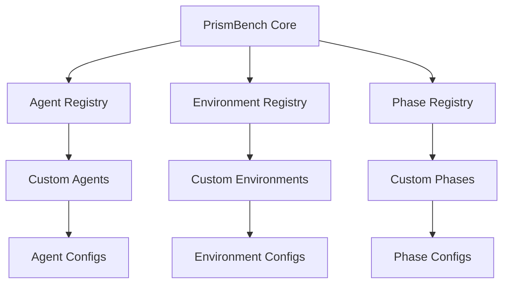

# Extending PrismBench

> Comprehensive guide to extending the PrismBench framework with custom components

PrismBench is designed with extensibility at its core. The framework provides three primary extension points that allow you to customize behavior for your specific evaluation needs:

## Extension Overview

### 🤖 **Agent Extensions**
Create custom LLM agents with specialized prompts, behaviors, and interaction patterns.

**Use Cases:**
- Custom problem generators for domain-specific challenges
- Specialized solution validators 
- Domain-expert evaluators
- Multi-modal agents

**[Learn More →](Custom-Agents)**

---

### 🌍 **Environment Extensions**  
Build custom evaluation environments with specialized workflows and agent orchestration.

**Use Cases:**
- Multi-step problem solving environments
- Interactive coding challenges
- Domain-specific evaluation workflows
- Custom test generation and validation

**[Learn More →](Custom-Environments)**

---

### 🔍 **Phase Extensions**
Implement custom MCTS phases with specialized search strategies and evaluation objectives.

**Use Cases:**
- Alternative exploration strategies
- Domain-specific scoring functions
- Multi-objective optimization phases
- Custom convergence criteria

**[Learn More →](Custom-MCTS-Phases)**

---

## Architecture Overview

PrismBench uses a **registry pattern** for all extensions, enabling:

- **Plugin Architecture**: Extensions are automatically discovered and loaded
- **Decorator-Based Registration**: Simple decorators register new components
- **Runtime Resolution**: Components are resolved dynamically at execution time
- **Configuration-Driven**: All behavior customizable through YAML files



---

## Quick Start Guide

### 1. **Choose Your Extension Type**

| Extension Type | Use Case |
|----------------|----------|
| **Agent** | Custom prompts, specialized behaviors |
| **Environment** | Custom workflows, agent orchestration |
| **Phase** | Search strategies, evaluation objectives |

### 2. **Development Workflow**

1. **Create** your extension using the provided templates
2. **Configure** behavior through YAML files
3. **Test** your extension with the framework
4. **Deploy** by placing files in the appropriate directories

### 3. **Extension Integration**

All extensions integrate seamlessly:

```python
# Extensions are automatically discovered
from src.services.llm_interface.src.llm.interface import LLMInterface
from src.services.environment.src.environment.utils import create_environment
from src.services.search.src.mcts.utils import create_phase

# Use your custom components
custom_environment = create_environment("my_custom_environment")
custom_phase = create_phase("my_custom_phase", tree, environment, config)
```

---

## Extension Combinations

The true power of PrismBench comes from **combining extensions**:

**[Combination Strategies →](Extension-Combinations)**

---

## Best Practices

### **Development Guidelines**

- **Follow Naming Conventions**: Use descriptive, consistent names
- **Document Thoroughly**: Include docstrings and configuration examples  

### **Performance Considerations**

- **Async Operations**: Use async/await for IO-bound operations
- **Resource Management**: Properly cleanup resources (sessions, files)

### **Integration Tips**

- **Configuration Schema**: Follow existing YAML patterns
- **Error Handling**: Use framework exception types
- **State Management**: Leverage framework session management

---

## Community Extensions

### **Contributing Extensions**

1. **Follow** the [Contributing Guide](https://github.com/PrismBench/PrismBench/blob/main/CONTRIBUTING.md)
2. **Test** thoroughly with multiple scenarios
3. **Document** usage and configuration
4. **Submit** pull request with examples

### **Extension Gallery**

***Coming soon***

---

## Support & Resources

### **Documentation**
- [Architecture Overview](Architecture-Overview) - Framework design
- [Configuration Guide](Configuration-Overview) - YAML configuration
- [API Reference](LLM-Interface-API) - Service APIs

### **Community**
- [📖 Contributing Guide](https://github.com/PrismBench/PrismBench/blob/main/CONTRIBUTING.md)
- [💬 Discussions](https://github.com/PrismBench/PrismBench/discussions)
- [🐛 Report Issues](https://github.com/PrismBench/PrismBench/issues)

---

## Related Pages

### 🔧 **Extension Guides**
- [🧩 Custom Agents](Custom-Agents) - Creating specialized agents with custom prompts
- [🌐 Custom Environments](Custom-Environments) - Building custom evaluation environments  
- [🔍 Custom MCTS Phases](Custom-MCTS-Phases) - Implementing custom search strategies
- [🔗 Extension Combinations](Extension-Combinations) - Advanced extension strategies

### 🏗️ **System Understanding**
- [🏗️ Architecture Overview](Architecture-Overview) - Framework design and components
- [🤖 Agent System](Agent-System) - Multi-agent architecture
- [🌍 Environment System](Environment-System) - Evaluation environments
- [🧠 MCTS Algorithm](MCTS-Algorithm) - Monte Carlo Tree Search

### 🚀 **Getting Started**
- [⚡ Quick Start](Quick-Start) - Basic setup and first run
- [📋 Configuration Overview](Configuration-Overview) - Configuration system
- [🆘 Troubleshooting](Troubleshooting) - Common issues and solutions