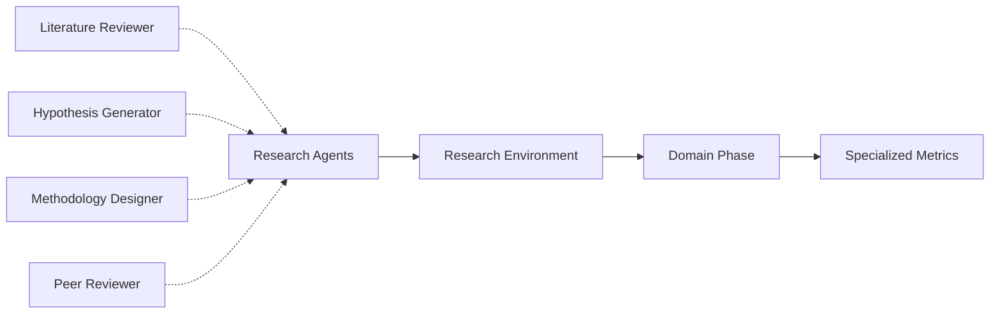
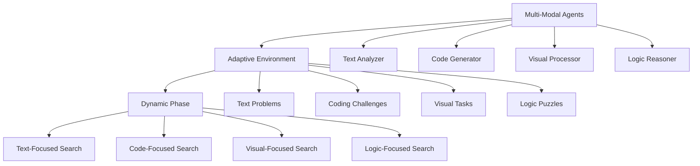

# Extension Combinations

> Advanced strategies for combining agents, environments, and phases to create sophisticated evaluation workflows

The real power of PrismBench emerges when you combine different extension types. This page explores patterns for creating advanced evaluation systems through strategic combinations of custom agents, environments, and MCTS phases.

## Overview

Extension combinations enable sophisticated evaluation scenarios that go beyond individual components:

- **Agent + Environment**: Create specialized evaluation workflows
- **Environment + Phase**: Optimize search strategies for specific domains
- **Agent + Phase**: Tailor search behavior to agent capabilities
- **All Three**: Build complete custom evaluation systems

---

## Combination Patterns

### **Domain-Specific Evaluation Pipeline**

**Scenario**: Evaluate LLM performance in scientific research



**Implementation**:

```python
# Custom research agents
research_agents = [
    "literature_reviewer",    # Analyzes existing research
    "hypothesis_generator",   # Forms testable hypotheses  
    "methodology_designer",   # Designs research methods
    "peer_reviewer"          # Critically evaluates research
]

# Research evaluation environment
@environment_registry.register_environment_method(
    "environment_research_evaluation", 
    "execute_node"
)
async def execute_node(
    self: "BaseEnvironment",
    research_domain: str,
    complexity_level: str,
    **kwargs
) -> Dict:
    """Comprehensive research evaluation workflow."""
    
    # Literature analysis phase
    literature = await self.agents["literature_reviewer"].interact(
        domain=research_domain,
        depth=complexity_level,
        focus="recent_advances"
    )
    
    # Hypothesis generation phase
    hypotheses = await self.agents["hypothesis_generator"].interact(
        literature_base=literature,
        domain=research_domain,
        novelty_requirement=complexity_level
    )
    
    # Methodology design phase
    methodology = await self.agents["methodology_designer"].interact(
        hypotheses=hypotheses,
        constraints=complexity_level,
        domain_requirements=research_domain
    )
    
    # Peer review phase
    review = await self.agents["peer_reviewer"].interact(
        research_proposal={
            "literature": literature,
            "hypotheses": hypotheses, 
            "methodology": methodology
        },
        review_criteria=complexity_level
    )
    
    return {
        "success": self._evaluate_research_quality(review),
        "data_trail": [{
            "domain": research_domain,
            "literature_quality": self._score_literature(literature),
            "hypothesis_novelty": self._score_hypotheses(hypotheses),
            "methodology_rigor": self._score_methodology(methodology),
            "peer_review_score": self._score_review(review),
            "overall_innovation": self._calculate_innovation_score(review)
        }]
    }

# Research-focused MCTS phase
@phase_registry.register_phase_method("phase_research", "calculate_node_value")
def calculate_node_value(
    self: "BasePhase",
    results: Dict,
    **kwargs
) -> float:
    """Research-specific value calculation."""
    
    trail = results["data_trail"][0]
    
    # Weight research-specific criteria
    research_score = (
        trail["literature_quality"] * 0.25 +
        trail["hypothesis_novelty"] * 0.35 +
        trail["methodology_rigor"] * 0.25 +
        trail["overall_innovation"] * 0.15
    )
    
    # Bonus for breakthrough potential
    if trail["overall_innovation"] > 0.8:
        research_score += 0.2
    
    return min(1.0, research_score)
```

---

### **Multi-Modal Evaluation System**

**Scenario**: Evaluate across different problem types and solution approaches



**Implementation**:

```python
# Adaptive environment that switches between modalities
@environment_registry.register_environment_method(
    "environment_multi_modal",
    "execute_node"
)
async def execute_node(
    self: "BaseEnvironment",
    concept: str,
    difficulty_level: str,
    modality: str = "auto",
    **kwargs
) -> Dict:
    """Multi-modal evaluation environment."""
    
    # Determine modality if auto-selection
    if modality == "auto":
        modality = self._select_optimal_modality(concept, difficulty_level)
    
    # Route to appropriate agent combination
    if modality == "text":
        return await self._execute_text_evaluation(concept, difficulty_level)
    elif modality == "code":
        return await self._execute_code_evaluation(concept, difficulty_level)
    elif modality == "visual":
        return await self._execute_visual_evaluation(concept, difficulty_level)
    elif modality == "logic":
        return await self._execute_logic_evaluation(concept, difficulty_level)
    else:
        # Multi-modal combination
        return await self._execute_combined_evaluation(
            concept, difficulty_level, modality
        )

async def _execute_combined_evaluation(
    self,
    concept: str,
    difficulty_level: str,
    modality_mix: str
) -> Dict:
    """Execute evaluation across multiple modalities."""
    
    modalities = modality_mix.split("+")
    results = {}
    
    # Execute in parallel across modalities
    tasks = []
    for mod in modalities:
        if mod == "text":
            task = self._execute_text_evaluation(concept, difficulty_level)
        elif mod == "code":
            task = self._execute_code_evaluation(concept, difficulty_level)
        # ... etc
        tasks.append(task)
    
    modal_results = await asyncio.gather(*tasks)
    
    # Integrate cross-modal results
    integrated_score = self._integrate_modal_scores(modal_results)
    
    return {
        "success": integrated_score > 0.6,
        "data_trail": [{
            "concept": concept,
            "modality_mix": modality_mix,
            "modal_results": modal_results,
            "integrated_score": integrated_score,
            "cross_modal_consistency": self._measure_consistency(modal_results)
        }]
    }

# Dynamic phase that adapts to modality
@phase_registry.register_phase_method("phase_adaptive_modal", "select_node")
async def select_node(self: "BasePhase") -> "ChallengeNode":
    """Modality-aware node selection."""
    
    available_nodes = self._get_available_nodes()
    
    # Group nodes by modality
    modal_groups = {}
    for node in available_nodes:
        modality = getattr(node, 'modality', 'unknown')
        if modality not in modal_groups:
            modal_groups[modality] = []
        modal_groups[modality].append(node)
    
    # Select modality based on recent performance
    target_modality = self._select_target_modality(modal_groups)
    
    # Select best node from target modality
    if target_modality in modal_groups:
        return self._select_best_from_modality(
            modal_groups[target_modality], 
            target_modality
        )
    
    # Fallback to standard selection
    return random.choice(available_nodes) if available_nodes else None
```

---

### **Progressive Difficulty System**

**Scenario**: Gradually increase challenge complexity based on performance

```python
# Progressive agents with difficulty awareness
progression_agents = [
    "adaptive_challenge_designer",  # Adjusts difficulty based on performance
    "progressive_validator",        # Validates against increasing standards  
    "difficulty_assessor",         # Evaluates current difficulty level
    "mastery_tracker"              # Tracks learning progression
]

# Progressive environment
@environment_registry.register_environment_method(
    "environment_progressive_learning",
    "execute_node"
)
async def execute_node(
    self: "BaseEnvironment",
    concept: str,
    current_mastery: float,
    progression_rate: float = 0.1,
    **kwargs
) -> Dict:
    """Progressive difficulty evaluation environment."""
    
    # Assess current mastery level
    mastery_assessment = await self.agents["mastery_tracker"].interact(
        concept=concept,
        current_level=current_mastery,
        historical_performance=kwargs.get("history", [])
    )
    
    # Determine appropriate next difficulty
    target_difficulty = self._calculate_target_difficulty(
        mastery_assessment, progression_rate
    )
    
    # Generate appropriately challenging problem
    problem = await self.agents["adaptive_challenge_designer"].interact(
        concept=concept,
        target_difficulty=target_difficulty,
        mastery_context=mastery_assessment
    )
    
    # Attempt solution
    solution_attempts = []
    for attempt in range(3):
        solution = await self.agents["problem_solver"].interact(
            problem_statement=problem,
            attempt_number=attempt,
            previous_attempts=solution_attempts
        )
        solution_attempts.append(solution)
        
        # Progressive validation
        validation = await self.agents["progressive_validator"].interact(
            problem=problem,
            solution=solution,
            difficulty_target=target_difficulty,
            mastery_context=mastery_assessment
        )
        
        if validation.get("success", False):
            break
    
    # Assess learning progression
    progression_analysis = await self.agents["difficulty_assessor"].interact(
        problem=problem,
        solutions=solution_attempts,
        target_difficulty=target_difficulty,
        mastery_progression=mastery_assessment
    )
    
    return {
        "success": validation.get("success", False),
        "data_trail": [{
            "concept": concept,
            "initial_mastery": current_mastery,
            "target_difficulty": target_difficulty,
            "solution_attempts": len(solution_attempts),
            "progression_score": progression_analysis.get("progression_score", 0),
            "mastery_improvement": progression_analysis.get("mastery_delta", 0),
            "recommended_next_level": progression_analysis.get("next_difficulty", target_difficulty)
        }]
    }

# Progressive MCTS phase
@phase_registry.register_phase_method("phase_progressive", "expand_node")
async def expand_node(
    self: "BasePhase",
    node: "ChallengeNode"
) -> None:
    """Progressive expansion based on mastery levels."""
    
    current_mastery = getattr(node, 'mastery_level', 0.5)
    
    # Only expand if mastery threshold is met
    mastery_threshold = self.config["phase_params"].get("mastery_threshold", 0.6)
    
    if current_mastery >= mastery_threshold:
        # Expand to next difficulty level
        await self._expand_difficulty_progression(node)
    else:
        # Expand laterally with similar difficulty
        await self._expand_lateral_concepts(node)
        
    # Update mastery tracking
    self._update_mastery_tracking(node, current_mastery)
```

---

### **Collaborative Evaluation Network**

**Scenario**: Multiple specialized agents collaborate and compete

```python
# Collaborative agent network
collaboration_agents = [
    "idea_generator",      # Generates initial concepts
    "concept_refiner",     # Refines and improves ideas
    "solution_architect",  # Designs overall solution structure
    "implementation_specialist",  # Implements specific components
    "quality_assessor",    # Evaluates quality across dimensions
    "integration_manager", # Coordinates collaboration
    "peer_reviewer",       # Provides external perspective
    "competition_judge"    # Evaluates competitive solutions
]

@environment_registry.register_environment_method(
    "environment_collaborative_network",
    "execute_node"
)
async def execute_node(
    self: "BaseEnvironment",
    challenge: str,
    collaboration_mode: str = "cooperative",
    **kwargs
) -> Dict:
    """Collaborative network evaluation environment."""
    
    if collaboration_mode == "cooperative":
        return await self._execute_cooperative_workflow(challenge)
    elif collaboration_mode == "competitive":
        return await self._execute_competitive_workflow(challenge)
    else:  # hybrid
        return await self._execute_hybrid_workflow(challenge)

async def _execute_cooperative_workflow(self, challenge: str) -> Dict:
    """Cooperative multi-agent workflow."""
    
    # Phase 1: Collaborative ideation
    ideas = await self.agents["idea_generator"].interact(
        challenge=challenge,
        mode="brainstorming"
    )
    
    refined_concepts = await self.agents["concept_refiner"].interact(
        initial_ideas=ideas,
        refinement_focus="feasibility"
    )
    
    # Phase 2: Collaborative design
    architecture = await self.agents["solution_architect"].interact(
        concepts=refined_concepts,
        challenge_requirements=challenge
    )
    
    # Phase 3: Collaborative implementation
    implementation_tasks = self._decompose_implementation(architecture)
    implementations = []
    
    for task in implementation_tasks:
        impl = await self.agents["implementation_specialist"].interact(
            task_specification=task,
            architecture_context=architecture,
            collaboration_context=implementations
        )
        implementations.append(impl)
    
    # Phase 4: Integration and quality assessment
    integration = await self.agents["integration_manager"].interact(
        implementations=implementations,
        architecture=architecture,
        quality_targets=challenge
    )
    
    quality_assessment = await self.agents["quality_assessor"].interact(
        integrated_solution=integration,
        original_challenge=challenge,
        collaboration_process={
            "ideas": ideas,
            "concepts": refined_concepts,
            "architecture": architecture,
            "implementations": implementations
        }
    )
    
    return {
        "success": quality_assessment.get("overall_success", False),
        "data_trail": [{
            "challenge": challenge,
            "collaboration_quality": self._assess_collaboration(quality_assessment),
            "solution_quality": quality_assessment.get("solution_score", 0),
            "process_efficiency": self._calculate_process_efficiency(quality_assessment),
            "innovation_level": quality_assessment.get("innovation_score", 0)
        }]
    }

async def _execute_competitive_workflow(self, challenge: str) -> Dict:
    """Competitive multi-agent workflow."""
    
    # Multiple agents compete to solve the challenge
    competitors = [
        "solution_architect",
        "implementation_specialist", 
        "idea_generator"
    ]
    
    # Parallel competitive solutions
    competitive_solutions = []
    
    for competitor in competitors:
        solution = await self.agents[competitor].interact(
            challenge=challenge,
            mode="competitive",
            time_limit=300  # 5 minute limit
        )
        competitive_solutions.append({
            "agent": competitor,
            "solution": solution
        })
    
    # Judge evaluates all solutions
    competition_results = await self.agents["competition_judge"].interact(
        challenge=challenge,
        solutions=competitive_solutions,
        evaluation_criteria=["correctness", "efficiency", "creativity", "completeness"]
    )
    
    # Peer review of top solutions
    top_solutions = competition_results.get("top_solutions", [])
    peer_reviews = []
    
    for solution in top_solutions[:2]:  # Review top 2
        review = await self.agents["peer_reviewer"].interact(
            solution=solution,
            challenge=challenge,
            review_focus="comprehensive"
        )
        peer_reviews.append(review)
    
    return {
        "success": len(top_solutions) > 0,
        "data_trail": [{
            "challenge": challenge,
            "num_competitors": len(competitors),
            "competition_results": competition_results,
            "peer_reviews": peer_reviews,
            "winner": competition_results.get("winner", None),
            "innovation_diversity": self._measure_solution_diversity(competitive_solutions)
        }]
    }
```

---

## Best Practices

### **Design Principles**

- **Modular Integration**: Keep extensions loosely coupled but well-coordinated
- **Data Flow Management**: Design clear data passing between components
- **Performance Monitoring**: Track performance across all extension layers
- **Graceful Degradation**: Handle failures in individual components gracefully

### **Scaling Considerations**

- **Resource Management**: Monitor and manage computational resources
- **Parallel Execution**: Leverage async operations for independent components
- **Configuration Complexity**: Keep configuration manageable despite complexity

### **Testing Strategies**

- **Component Testing**: Test each extension type independently
- **Integration Testing**: Test combinations systematically
- **End-to-End Testing**: Validate complete workflows

---

## Troubleshooting

### **Common Integration Issues**

| Issue | Cause | Solution |
|-------|-------|----------|
| Data format mismatch | Incompatible outputs between extensions | Standardize data schemas |
| Resource conflicts | Multiple extensions competing for resources | Implement resource management |
| Configuration complexity | Too many interacting parameters | Use hierarchical configuration |
| Performance degradation | Inefficient component interactions | Profile and optimize bottlenecks |

### **Debugging Complex Workflows**

1. **Component Isolation**: Test each extension type separately
2. **Data Flow Tracing**: Log data transformations between components
3. **Incremental Integration**: Add complexity gradually

---

## Next Steps

- **[Architecture Overview](Architecture-Overview)** - Understand system design
- **[Configuration Guide](Configuration-Overview)** - Master configuration management
- **[Custom Agents](Custom-Agents)** - Create specialized agents
- **[Custom Environments](Custom-Environments)** - Build evaluation environments
- **[Custom MCTS Phases](Custom-MCTS-Phases)** - Implement search strategies

---

## Related Pages

### 🔧 **Individual Extensions**
- [🧩 Custom Agents](Custom-Agents) - Creating specialized agents
- [🌐 Custom Environments](Custom-Environments) - Building evaluation environments
- [🔍 Custom MCTS Phases](Custom-MCTS-Phases) - Implementing search strategies
- [🔧 Extending PrismBench](Extending-PrismBench) - Framework extension overview

### 🏗️ **System Architecture**
- [🏗️ Architecture Overview](Architecture-Overview) - Framework design and components
- [🤖 Agent System](Agent-System) - Multi-agent architecture
- [🌍 Environment System](Environment-System) - Evaluation environments
- [🧠 MCTS Algorithm](MCTS-Algorithm) - Monte Carlo Tree Search

### 🛠️ **Implementation**
- [📋 Configuration Overview](Configuration-Overview) - Configuration management
- [📊 Results Analysis](Results-Analysis) - Understanding evaluation results
- [🆘 Troubleshooting](Troubleshooting) - Common issues and solutions
