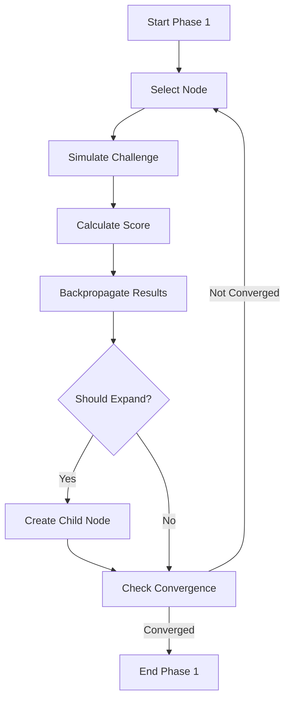
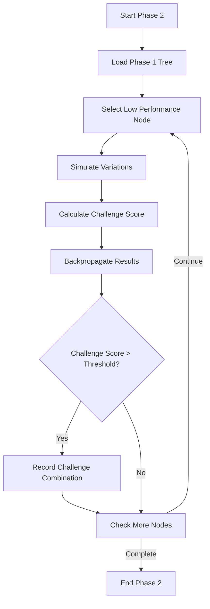

# Monte Carlo Tree Search (MCTS) Algorithm

This document provides a comprehensive explanation of how PrismBench uses Monte Carlo Tree Search to evaluate LLM capabilities.

## Overview

Monte Carlo Tree Search (MCTS) is a probabilistic search algorithm that combines tree search principles with random sampling to find optimal decisions. PrismBench uses MCTS to systematically explore the space of computer science concepts and difficulty levels to map LLM capabilities.

## Core MCTS Process

MCTS iteratively builds a search tree through four key steps:

### 1. Selection
Starting from the root, navigate through the tree using a selection policy (like UCB1) that balances exploration and exploitation until reaching a leaf node.

### 2. Expansion  
Create one or more child nodes from the selected leaf node to explore new states.

### 3. Simulation
From the new node, perform a "rollout" by simulating random actions until reaching a terminal state or predefined depth.

### 4. Backpropagation
Update the statistics (visits and values) of all nodes along the path from the simulated node back to the root.

## Key Components

### UCB1 Formula
Balances exploration vs exploitation using:

```
UCB1 = average_value + C * sqrt(ln(total_parent_visits) / node_visits)
```

Where:
- `average_value` is the node's historical performance
- `C` is an exploration constant (typically √2)
- `total_parent_visits` is the parent node's visit count
- `node_visits` is this node's visit count

### Node Statistics

Each node maintains:
- **Visit count**: Number of times node was traversed
- **Value**: Aggregated results from simulations
- **Children**: Available next states/concepts

## PrismBench's Three-Phase MCTS

### Phase 1: Initial Capability Mapping

**Objective**: Understand the model's basic capabilities across different concepts.

**Process**:


**Key Features**:
- Runs until value convergence is achieved
- Node selection uses inverse probability distribution to favor less-explored nodes
- Score calculation considers:
  - Challenge success/failure
  - Number of tests passed
  - Penalties for failures, errors, and multiple attempts
  - Difficulty level weighting
- Node expansion occurs when:
  - Node value exceeds performance threshold
  - Node depth is below maximum
- Expansion happens by either:
  - Combining with another node to add new concepts
  - Increasing difficulty level

### Phase 2: Challenge Discovery

**Objective**: Identify areas where the model struggles.

**Process**:


**Key Features**:
- Uses UCB (Upper Confidence Bound) with challenge metrics
- Challenge score calculation considers:
  - Inverse success rate
  - Number of attempts needed
  - Whether fixes were required
- Node expansion prioritizes:
  - Combinations exceeding challenge threshold
  - Increasing difficulty for challenging nodes
  - Adding new concepts for non-challenging nodes
- Maintains a record of challenging combinations with their scores

### Phase 3: Comprehensive Evaluation

**Objective**: Deeply understand the model's challenges.

**Process**:


**Key Features**:
- Takes challenging nodes identified in Phase 2
- Generates multiple problem variations per concept combination
- Records detailed challenge descriptions and results
- Maintains full history of:
  - Problem statements
  - Solution attempts
  - Test cases
  - Performance metrics

## Scoring System

### Base Score Calculation

```python
base_score = (tests_passed / total_tests) * difficulty_multiplier
```

### Penalty System

```python
final_score = base_score - (
    num_failures * penalty_per_failure +
    num_errors * penalty_per_error +
    (attempts - 1) * penalty_per_attempt +
    (1 if fixed_by_fixer else 0) * fixer_penalty
)
```

### Difficulty Multipliers

- **Easy**: 1.0x
- **Medium**: 1.5x  
- **Hard**: 2.0x
- **Expert**: 3.0x

## Node Expansion Strategies

### Concept Combination
Nodes can expand by combining with other concepts:
```
[Arrays] + [Sorting] → [Arrays, Sorting]
```

### Difficulty Progression
Nodes can expand to higher difficulty levels:
```
[Dynamic Programming, Easy] → [Dynamic Programming, Medium]
```

## Convergence Criteria

### Value Convergence
Achieved when node values stabilize:
```python
convergence = abs(current_value - previous_value) < threshold
```

### Visit Count Convergence
Ensures sufficient exploration:
```python
min_visits_per_node = total_simulations / num_nodes * min_ratio
```

## Algorithm Parameters

### Exploration Constants
- **UCB1 C value**: √2 (standard) to 2.0 (high exploration)
- **Exploration probability**: 0.1-0.3 for random node selection

### Convergence Thresholds
- **Value delta**: 0.01-0.05 for stability detection
- **Convergence checks**: 3-10 consecutive stable iterations

### Performance Thresholds
- **Expansion threshold**: 0.6-0.8 minimum performance
- **Challenge threshold**: 0.2-0.4 maximum performance for challenges

## Implementation Details

### Tree Structure
```python
class MCTSNode:
    def __init__(self):
        self.concepts = []          # CS concepts in this node
        self.difficulty = "easy"    # Difficulty level
        self.visits = 0            # Visit count
        self.value = 0.0           # Average performance
        self.children = []         # Child nodes
        self.parent = None         # Parent node
```

### Selection Policy
```python
def select_node(node):
    if not node.children:
        return node
    
    best_child = max(node.children, key=lambda c: ucb1_score(c))
    return select_node(best_child)
```

### Backpropagation
```python
def backpropagate(node, score):
    while node:
        node.visits += 1
        node.value = (node.value * (node.visits - 1) + score) / node.visits
        node = node.parent
```

For implementation details, see the [Search Service README](../src/services/search/README.md).

---

## Related Pages

### 🌳 **Tree & Search**
- [🌳 Tree Structure](Tree-Structure) - Search tree implementation details
- [🔍 Custom MCTS Phases](Custom-MCTS-Phases) - Implementing custom search strategies
- [📊 Results Analysis](Results-Analysis) - Analyzing MCTS results

### 🏗️ **System Integration**
- [🏗️ Architecture Overview](Architecture-Overview) - How MCTS fits in the system
- [🌍 Environment System](Environment-System) - Evaluation environments
- [🤖 Agent System](Agent-System) - Agent integration

### 🛠️ **Advanced Usage**
- [🔧 Extending PrismBench](Extending-PrismBench) - Framework extensions
- [🔗 Extension Combinations](Extension-Combinations) - Combining MCTS with custom components
- [📋 Configuration Overview](Configuration-Overview) - MCTS configuration parameters 