# 🌳 Tree Structure

*This page contains the content from the original tree-structure.md file - you'll need to copy the content from that file here for GitHub Wiki compatibility.*

For now, this is a placeholder. Please copy the content from `docs/tree-structure.md` to this file.

---

**[⬅️ Back to Results Analysis](Results-Analysis)** | **[Troubleshooting ➡️](Troubleshooting)**

The search tree is the core data structure in PrismBench's MCTS algorithm. It represents the exploration space of concept-difficulty combinations and tracks the evaluation history for intelligent search guidance.

## Tree Architecture

### Overview

The search tree is a **dynamic, hierarchical structure** where nodes represent specific combinations of CS concepts and difficulty levels. The tree grows iteratively as the MCTS algorithm explores the capability space.

```mermaid
graph TB
    subgraph "Tree Structure"
        Root[Root Node<br/>🌳 Search Space]
        
        subgraph "Level 1 - Single Concepts"
            L1A[loops : easy]
            L1B[functions : medium]
            L1C[arrays : hard]
        end
        
        subgraph "Level 2 - Concept Combinations"
            L2A[loops + arrays : medium]
            L2B[functions + loops : hard]
            L2C[arrays + sorting : very hard]
        end
        
        subgraph "Level 3 - Complex Combinations"
            L3A[loops + arrays + sorting : hard]
            L3B[functions + recursion + trees : very hard]
        end
    end
    
    Root --> L1A
    Root --> L1B
    Root --> L1C
    L1A --> L2A
    L1A --> L2B
    L1B --> L2B
    L1C --> L2A
    L1C --> L2C
    L2A --> L3A
    L2C --> L3A
    L2B --> L3B
```



### Design Principles

#### 1. **Hierarchical Organization**
- **Root Level**: Entry point for all searches
- **Single Concepts**: Individual CS concepts at various difficulties
- **Combinations**: Multiple concepts tested together
- **Complex Nodes**: Advanced multi-concept combinations

#### 2. **State Tracking**
- **Visit Counts**: Number of times each node has been evaluated
- **Value Accumulation**: Running average of performance scores
- **Historical Data**: Complete evaluation history for analysis
- **Phase Information**: Which MCTS phase created/modified the node

#### 3. **Dynamic Growth**
- **On-Demand Expansion**: Nodes created as search progresses
- **Intelligent Branching**: Strategic child node generation
- **Pruning Capability**: Remove unproductive branches

#### 4. **Multi-Phase Evolution**
- **Phase 1**: Initial exploration and capability mapping
- **Phase 2**: Challenge identification and difficulty probing
- **Phase 3**: Deep evaluation of challenging areas

## Node Structure

### ChallengeNode Class

The fundamental building block of the search tree:

```python
class ChallengeNode:
    def __init__(
        self,
        difficulty: str,
        concepts: list[str],
        challenge_description: str,
        parents: Union["ChallengeNode", list["ChallengeNode"], None] = None,
        depth: int = 0,
        phase: int = 1,
    ):
        """
        Initializes a new node for the MCTS tree.

        Parameters:
        - difficulty (str): The difficulty level of the challenge.
        - concepts (list): The list of concepts related to the challenge.
        - challenge_description (str): The description of the challenge.
        - parents (Union[ChallengeNode, list[ChallengeNode], None], optional): The parent nodes of the current node.
            Defaults to None.
        - depth (int, optional): The depth of the current node in the tree. Defaults to 0.
        - phase (int, optional): The phase of the current node. Defaults to 1.
        """
        self.id = str(uuid4())

        self.difficulty = difficulty
        self.concepts = [concepts] if isinstance(concepts, str) else concepts
        self.challenge_description = challenge_description

        self.problem_statement = {}
        self.solution_code = {}
        self.test_cases = {}
        self.problem_fixer = {}

        self.parents = parents
        self.children = []
        self.depth = depth

        self.visits = 0
        self.successes = 0
        self.failures = 0
        self.score = 0
        self.phase = phase

        self.run_results = []
        self.value = 0.0  # Initialize the node's value

        logger.debug(f"Created node: Difficulty={difficulty}, Concepts={concepts}, Depth={depth}")

    def get_node_ancestors_ids(self) -> list[str]:
        """
        Returns a list of all ancestor node IDs.

        Returns:
        - list[str]: A list of all ancestor node IDs.
        """
        ancestor_ids = set()
        current_nodes = self.parents if self.parents else []

        while current_nodes:
            next_nodes = []
            for node in current_nodes:
                if node.id not in ancestor_ids:
                    ancestor_ids.add(node.id)
                    if node.parents:
                        next_nodes.extend(node.parents)
            current_nodes = next_nodes
        return list(ancestor_ids)

    def update_node_score(self, learning_rate: float, reward: float) -> None:
        """
        Updates the node's value using a TD learning update.

        Parameters:
        - reward (float): The normalized reward between 0 and 1.

        Returns:
        - None
        """
        self.visits += 1
        self.value += learning_rate * (reward - self.value)

        logger.debug(f"Updated node value: New value={self.value:.2f}, Reward={reward:.2f}")

    def ucb1(self, exploration_weight=1.414) -> float:
        """
        Calculates the UCB1 (Upper Confidence Bound 1) value for a node in a tree search.

        Parameters:
            exploration_weight (float): The exploration weight to balance exploration and exploitation.
                Default is 1.414.

        Returns:
            float: The UCB1 value for the node.
        """

        if self.visits == 0:
            return float("inf")

        exploitation = self.value
        exploration = math.sqrt(
            math.log(sum([parent.visits for parent in self.parents]) if len(self.parents) > 1 else 1) / self.visits
        )

        return exploitation + exploration_weight * exploration

    def to_dict(self) -> dict:
        """
        Serializes the ChallengeNode to a dictionary suitable for JSON export.
        Only includes basic fields and references children by their IDs to avoid recursion.

        Returns:
            dict: A dictionary representation of the node.
        """
        return {
            "id": self.id,
            "difficulty": self.difficulty,
            "concepts": self.concepts,
            "challenge_description": self.challenge_description,
            "problem_statement": self.problem_statement,
            "solution_code": self.solution_code,
            "test_cases": self.test_cases,
            "problem_fixer": self.problem_fixer,
            "depth": self.depth,
            "visits": self.visits,
            "successes": self.successes,
            "failures": self.failures,
            "score": self.score,
            "phase": self.phase,
            "run_results": self.run_results,
            "value": self.value,
            "children": [child.id for child in self.children],
            "parents": [parent.id for parent in self.parents] if self.parents else [],
        }
```

### Node Types

#### Root Node
- **Purpose**: Entry point for all searches
- **Characteristics**: No concepts, serves as anchor
- **Children**: Single-concept nodes at various difficulties

#### Concept Nodes
- **Single Concept**: Tests one CS concept (e.g., "loops : medium")
- **Multi-Concept**: Tests concept combinations (e.g., "loops + arrays : hard")
- **Advanced Combinations**: Complex multi-concept challenges

#### Terminal Nodes
- **Definition**: Nodes that cannot be expanded further
- **Criteria**: Maximum depth reached, no valid expansions, or marked terminal
- **Purpose**: End points for search paths

## Tree Operations

### Node Selection

#### UCB1 Algorithm
The Upper Confidence Bound (UCB1) algorithm balances exploration and exploitation:

```python
def select_best_child(node: ChallengeNode, exploration_constant: float) -> ChallengeNode:
    """Select child with highest UCB1 score."""
    if not node.children:
        return None
    
    best_child = None
    best_score = float('-inf')
    
    for child in node.children:
        score = child.ucb1_score(exploration_constant)
        if score > best_score:
            best_score = score
            best_child = child
    
    return best_child
```

#### Phase-Specific Selection

**Phase 1 - Capability Mapping**:
```python
def select_node_phase1(tree: Tree) -> ChallengeNode:
    """Select node for capability exploration."""
    # Probability-based selection favoring less-explored areas
    if random.random() < exploration_probability:
        return select_random_unexplored(tree)
    else:
        return select_ucb1_best(tree.root)
```

**Phase 2 - Challenge Discovery**:
```python
def select_node_phase2(tree: Tree) -> ChallengeNode:
    """Select node for challenge identification."""
    # Focus on nodes with poor performance
    candidates = [node for node in tree.nodes if node.value < challenge_threshold]
    if candidates:
        return select_ucb1_best_from(candidates)
    else:
        return select_ucb1_best(tree.root)
```

**Phase 3 - Comprehensive Evaluation**:
```python
def select_node_phase3(tree: Tree) -> ChallengeNode:
    """Select node for deep evaluation."""
    # Only evaluate challenging nodes identified in Phase 2
    challenging_nodes = [
        node for node in tree.nodes 
        if node.phase_created == 2 and node.value > selection_threshold
    ]
    return select_ucb1_best_from(challenging_nodes)
```

### Node Expansion

#### Expansion Strategies

**Concept Addition**:
```python
def expand_with_concept(parent: ChallengeNode, new_concept: str) -> ChallengeNode:
    """Add a new concept to create child node."""
    child_concepts = parent.concepts + [new_concept]
    child = ChallengeNode(
        concepts=child_concepts,
        difficulty=parent.difficulty,
        parent=parent
    )
    parent.children.append(child)
    return child
```

**Difficulty Progression**:
```python
def expand_with_difficulty(parent: ChallengeNode) -> ChallengeNode:
    """Increase difficulty to create child node."""
    next_difficulty = get_next_difficulty(parent.difficulty)
    if next_difficulty is None:
        return None  # Already at maximum difficulty
    
    child = ChallengeNode(
        concepts=parent.concepts,
        difficulty=next_difficulty,
        parent=parent
    )
    parent.children.append(child)
    return child
```

## Tree Analytics

### Statistical Analysis

#### Node Statistics
```python
class TreeAnalytics:
    def __init__(self, tree: Tree):
        self.tree = tree
    
    def node_statistics(self) -> Dict:
        """Calculate comprehensive node statistics."""
        all_nodes = list(self.tree.get_all_nodes())
        
        return {
            "total_nodes": len(all_nodes),
            "max_depth": max(node.depth for node in all_nodes),
            "avg_depth": sum(node.depth for node in all_nodes) / len(all_nodes),
            "total_visits": sum(node.visits for node in all_nodes),
            "avg_visits": sum(node.visits for node in all_nodes) / len(all_nodes),
            "concepts_explored": self._unique_concepts(all_nodes),
            "difficulties_explored": self._unique_difficulties(all_nodes)
        }
    
    def performance_analysis(self) -> Dict:
        """Analyze performance patterns across the tree."""
        all_nodes = [node for node in self.tree.get_all_nodes() if node.visits > 0]
        
        return {
            "avg_performance": sum(node.value for node in all_nodes) / len(all_nodes),
            "performance_std": self._calculate_std([node.value for node in all_nodes]),
            "best_performing": max(all_nodes, key=lambda x: x.value),
            "worst_performing": min(all_nodes, key=lambda x: x.value),
            "performance_by_depth": self._performance_by_depth(all_nodes),
            "performance_by_concepts": self._performance_by_concepts(all_nodes)
        }
```

#### Convergence Detection
```python
def detect_convergence(tree: Tree, window_size: int = 10) -> bool:
    """Detect if search has converged."""
    recent_evaluations = tree.get_recent_evaluations(window_size)
    
    if len(recent_evaluations) < window_size:
        return False
    
    # Check if recent values are stable
    values = [eval_result.value for eval_result in recent_evaluations]
    variance = np.var(values)
    
    return variance < convergence_threshold
```

### Visualization Support

#### Tree Structure Export
```python
def export_tree_structure(tree: Tree) -> Dict:
    """Export tree structure for visualization."""
    def node_to_dict(node: ChallengeNode) -> Dict:
        return {
            "id": node.get_id(),
            "concepts": node.concepts,
            "difficulty": node.difficulty,
            "visits": node.visits,
            "value": node.value,
            "depth": node.depth,
            "children": [node_to_dict(child) for child in node.children],
            "phase_created": node.phase_created
        }
    
    return {
        "root": node_to_dict(tree.root),
        "metadata": {
            "total_nodes": tree.count_nodes(),
            "max_depth": tree.max_depth(),
            "creation_time": tree.creation_time,
            "last_updated": tree.last_updated
        }
    }
```

#### Performance Heatmap Data
```python
def generate_heatmap_data(tree: Tree) -> Dict:
    """Generate data for concept-difficulty performance heatmap."""
    heatmap_data = {}
    
    for node in tree.get_all_nodes():
        if node.visits > 0:
            concept_key = "+".join(sorted(node.concepts))
            if concept_key not in heatmap_data:
                heatmap_data[concept_key] = {}
            
            heatmap_data[concept_key][node.difficulty] = {
                "value": node.value,
                "visits": node.visits,
                "confidence": min(node.visits / 10.0, 1.0)  # Confidence based on visits
            }
    
    return heatmap_data
```

## Tree Persistence

### Serialization
```python
def serialize_tree(tree: Tree) -> bytes:
    """Serialize tree to bytes for storage."""
    tree_data = {
        "root": tree.root.to_dict(),
        "metadata": tree.get_metadata(),
        "creation_time": tree.creation_time.isoformat(),
        "last_updated": tree.last_updated.isoformat()
    }
    return pickle.dumps(tree_data)

def deserialize_tree(data: bytes) -> Tree:
    """Deserialize tree from bytes."""
    tree_data = pickle.loads(data)
    tree = Tree.from_dict(tree_data["root"])
    tree.set_metadata(tree_data["metadata"])
    return tree
```


---

**Next Steps:**
- [🧠 MCTS Algorithm](mcts.md) - How MCTS uses the tree structure
- [🔍 Search API](api-search.md) - API for tree operations
- [📊 Results Analysis](analysis.md) - Analyzing tree data
- [🛡️ Best Practices](best-practices.md) - Tree optimization strategies

---

## Related Pages

### 🧠 **Core Algorithm**
- [🧠 MCTS Algorithm](MCTS-Algorithm) - How MCTS uses the tree structure
- [🔍 Custom MCTS Phases](Custom-MCTS-Phases) - Custom search strategies using trees
- [📊 Results Analysis](Results-Analysis) - Analyzing tree data and performance

### 🏗️ **System Architecture**
- [🏗️ Architecture Overview](Architecture-Overview) - Overall system design
- [🌍 Environment System](Environment-System) - How environments populate tree nodes
- [🤖 Agent System](Agent-System) - Agent evaluation in tree nodes

### 🛠️ **Implementation**
- [📋 Configuration Overview](Configuration-Overview) - Tree configuration parameters
- [🔧 Extending PrismBench](Extending-PrismBench) - Framework extensions
- [🆘 Troubleshooting](Troubleshooting) - Tree-related issues and solutions 