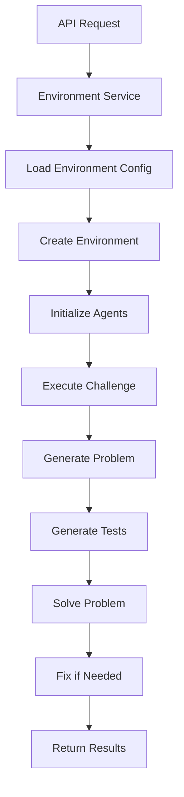

# Environment Service

[](https://fastapi.tiangolo.com/)
[](https://python.org)
[](https://docker.com)

> A flexible, containerized microservice for managing coding challenges, test generation, and solution evaluation with pluggable environment strategies.

## Table of Contents

- [Overview](#overview)
- [Quick Start](#quick-start)
- [Architecture](#architecture)
- [Built-in Environments](#built-in-environments)
- [API Reference](#api-reference)
- [Configuration](#configuration)
- [Development](#development)
- [Extending the Framework](#extending-the-framework)
- [Deployment](#deployment)

## Overview

The Environment Service provides a RESTful API for executing coding challenges across different environments, each optimized for specific evaluation objectives and agent configurations.

***The current provided environments (`environment_coding_challenge`, `environment_enhanced_coding_challenge`) are focused on coding challenges and LLM agent evaluation***.

However, the framework's modular architecture makes it easy to extend for any domain requiring agent-based problem solving and evaluation.

### Core Features

- **Pluggable Environments**: Decorator-based registry system for custom environments
- **Agent-Based Workflow**: Multi-agent orchestration for challenge generation and solving
- **Configuration-Driven**: External YAML configuration for all behaviors
- **Async-First**: Full asynchronous support for concurrent operations
- **Containerized**: Docker-ready for easy deployment

## Quick Start

### Prerequisites

- Python 3.12+
- Docker (optional, for containerized deployment)
- Access to LLM Interface Service

### Installation

```bash
# Install dependencies
uv pip install -e .

# Set up configuration
cp configs/environment_config.yaml.example configs/environment_config.yaml
# Edit environment_config.yaml with your settings

# Run the service
cd src
uvicorn main:app --reload --host 0.0.0.0 --port 8001
```

### Basic Usage Example

```python
# 1. Import and setup
from src.environment_client import EnvironmentClient
from src.core.config import get_settings
from src.services.environment_service import EnvironmentService

# 2. Initialize service
settings = get_settings()
service = EnvironmentService(settings)

# 3. Run a challenge
results = await service.run_challenge(
    environment_name="environment_coding_challenge",
    request=ChallengeRequest(
        concept="loops",
        difficulty_level="medium",
        max_attempts=3
    )
)
```

### Verify Installation

```bash
curl http://localhost:8001/health
```

**Expected Response:**
```json
{
  "message": "PrismBench - Environment Service - Alive",
  "documentation": "/docs",
  "redoc": "/redoc",
  "health": "/health"
}
```

## Architecture

### Project Structure

```
src/services/environment/
├── api/                           # REST API layer
│   └── v1/
│       ├── endpoints/             # API endpoints
│       │   ├── challenges.py      # Challenge execution endpoints
│       │   └── health.py          # Health check endpoints
│       └── router.py              # API router configuration
├── core/                          # Core functionality
│   ├── config.py                  # Configuration management
│   ├── dependencies.py            # Dependency injection
│   └── exceptions.py              # Custom exceptions
├── environment/                   # Environment implementations
│   ├── base_environment.py        # Base environment class
│   ├── environment_registry.py    # Environment registration system
│   ├── environment_coding_challenge.py      # Standard environment
│   ├── environment_enhanced_coding_challenge.py  # Enhanced environment
│   └── utils.py                   # Utility functions
├── models/                        # Data models
│   ├── domain.py                  # Domain models
│   ├── requests.py                # Request models
│   └── responses.py               # Response models
├── services/                      # Business logic
│   └── environment_service.py     # Main environment service
├── interface_client.py            # LLM interface client
└── main.py                        # FastAPI application
```

### Core Components

#### BaseEnvironment

The `BaseEnvironment` class provides the core environment functionality:

- **Agent Management**: Automatic initialization and management of LLM agents
- **Output Handling**: Temporary directory creation and cleanup for test execution
- **Process Pool**: Concurrent execution of test scripts using ProcessPoolExecutor
- **Strategy Pattern**: Uses environment registry for pluggable implementations

#### EnvironmentRegistry

The `EnvironmentRegistry` implements a decorator-based strategy pattern:

- **Dynamic Discovery**: Automatically discovers environment modules in the directory
- **Strategy Registration**: Register custom implementations using decorators
- **Runtime Resolution**: Dynamically resolve environment methods at execution time

#### Environment Interface

Each environment **must** implement the core method:

| Method | Purpose | Async | Description |
|--------|---------|-------|-------------|
| `execute_node` | Challenge Execution | ✅ | Defines how a coding challenge should be executed for the environment |

#### InterfaceClient

The `InterfaceClient` handles communication with the LLM Interface Service:

- **Session Management**: Automatic session initialization and cleanup
- **Async Communication**: Full async HTTP client with timeout support
- **Polling**: Intelligent polling for task completion status
- **Error Handling**: Robust error handling and retry logic

### Execution Flow



## Built-in Environments

The current implementation includes two reference environments for coding challenges:

### Standard Coding Challenge (`environment_coding_challenge`)

**Objective**: Execute standard coding challenges with basic agent workflow.

**Agents Required**:
- `challenge_designer`: Generates problem statements
- `test_generator`: Creates test cases
- `problem_solver`: Generates solutions
- `problem_fixer`: Fixes failed solutions

**Strategy Details**:
- Single problem per execution
- Standard test execution and evaluation
- Basic scoring and failure handling
- Up to max_attempts solution attempts + 1 final fix attempt

**Best For**: Standard evaluation, baseline assessment, single problem testing

### Enhanced Coding Challenge (`environment_enhanced_coding_challenge`)

**Objective**: Execute enhanced challenges with additional validation and multiple problems.

**Agents Required**:
- `challenge_designer_advanced`: Generates diverse problems avoiding duplicates
- `test_generator`: Creates test cases
- `test_validator`: Validates test case quality
- `problem_solver`: Generates solutions
- `problem_fixer`: Fixes failed solutions
- `test_error_analyzer`: Provides detailed error analysis

**Strategy Details**:
- Multiple problems per execution (configurable)
- Enhanced problem generation with duplicate avoidance
- Test validation and error analysis
- Comprehensive reporting and analysis

**Best For**: Comprehensive evaluation, test quality assurance, batch processing

## API Reference

### Interactive Documentation

- **Swagger UI**: [http://localhost:8001/docs](http://localhost:8001/docs)
- **ReDoc**: [http://localhost:8001/redoc](http://localhost:8001/redoc)

### REST Endpoints

#### Run Challenge
```http
POST /run-challenge?environment_name=environment_coding_challenge
Content-Type: application/json

{
  "concept": "loops",
  "difficulty_level": "medium",
  "max_attempts": 3
}
```

**Response:**
```json
{
  "success": true,
  "data_trail": [
    {
      "attempt_num": 0,
      "problem_statement": "Write a function that...",
      "test_cases": "def test_solution()...",
      "solution_code": "def solution()...",
      "tests_passed_num": 5,
      "tests_failed_num": 0,
      "tests_errored_num": 0,
      "success": true,
      "output": "All tests passed."
    }
  ]
}
```

#### Health Check
```http
GET /health
```

**Response:**
```json
{
  "message": "PrismBench - Environment Service - Alive",
  "documentation": "/docs",
  "redoc": "/redoc",
  "health": "/health"
}
```

### Python API

#### EnvironmentService Class

```python
class EnvironmentService:
    def __init__(self, settings: Settings)

    async def run_challenge(
        self,
        environment_name: str,
        request: ChallengeRequest
    ) -> Dict
```

#### BaseEnvironment Class

```python
class BaseEnvironment:
    def __init__(self, environment_name: str, **kwargs)

    async def initialize(self) -> None
    async def execute_node(self, **kwargs) -> Dict
    async def reset(self) -> None
```

## Configuration

### Environment Configuration

| Parameter | Type | Default | Description |
|-----------|------|---------|-------------|
| `agents` | List[str] | Required | List of agent names for this environment |
| `max_attempts` | int | 3 | Maximum solution attempts per problem |
| `timeout` | int | 300 | Request timeout in seconds |
| `num_problems` | int | 1 | Number of problems to generate |

### Application Settings

| Parameter | Type | Default | Description |
|-----------|------|---------|-------------|
| `app_name` | str | "PrismBench Environment Service" | Application name |
| `version` | str | "0.1.0" | Application version |
| `debug` | bool | False | Debug mode flag |
| `llm_service_url` | str | "http://llm-interface:8000" | LLM service URL |

### Environment Variables

| Variable | Description | Default |
|----------|-------------|---------|
| `LLM_SERVICE_URL` | URL of the LLM interface service | `http://llm-interface:8000` |
| `ENV_OUTPUT_DIR` | Directory for temporary test outputs | `/app/env_outputs` |
| `CONFIG_FILE_PATH` | Path to agent configuration file | `/app/configs/agents.yml` |

### Example Configuration

```yaml
# configs/environment_config.yaml
environment_coding_challenge:
  agents:
    - challenge_designer
    - test_generator  
    - problem_solver
    - problem_fixer
  max_attempts: 3
  timeout: 300
  num_problems: 1

environment_enhanced_coding_challenge:
  agents:
    - challenge_designer_advanced
    - test_generator
    - test_validator
    - problem_solver
    - problem_fixer
    - test_error_analyzer
  max_attempts: 3
  timeout: 300
  num_problems: 5
```

## Development

### Environment Philosophy

The Environment Service is built on several key principles:

- **Modularity**: Each environment is completely independent and can be mixed, matched, or replaced without affecting other components
- **Extensibility**: The decorator-based registry system allows for defining custom environments without modifying core framework code
- **Agent-Based**: Built-in support for multiple LLM agents with different roles (challenge designer, test generator, problem solver, problem fixer)
- **Configuration-Driven**: All environment behaviors can be tuned through external configuration files, supporting different experimental setups
- **Async-First**: Full asynchronous support for efficient concurrent operations and LLM interactions

### Running Tests

```bash
# Unit tests
pytest tests/unit/

# Integration tests  
pytest tests/integration/

# All tests
pytest
```

### Integration Points

#### LLM Interface Service

The Environment Service integrates with the LLM Interface Service for agent interactions:

- **Base URL**: `http://llm-interface:8000` (configurable)
- **Session Management**: Automatic session creation and cleanup
- **Agent Roles**: Each agent has a specific role configuration
- **Async Communication**: Non-blocking HTTP requests with polling

#### Search Service Integration

When used with the Search Service:

- **Environment Client**: Search service uses `EnvironmentClient` to communicate
- **Challenge Execution**: Provides evaluation results for MCTS nodes
- **Configuration**: Environment name specified in search phase configuration

## Extending the Framework

### Creating Custom Environments

#### Step 1: Environment Implementation

Create a new module for your custom environment:

```python
# my_custom_environment.py
from typing import TYPE_CHECKING, Dict
from loguru import logger
from src.environment.environment_registry import environment_registry

if TYPE_CHECKING:
    from src.environment.base_environment import BaseEnvironment

@environment_registry.register_environment_method(
    "my_custom_environment",
    "execute_node"
)
async def execute_node(
    self: "BaseEnvironment",
    custom_param: str,
    **kwargs
) -> Dict:
    """Custom environment execution logic."""
    # Initialize environment if needed
    if not self._initialized:
        await self.initialize()

    # Your custom logic here
    results = await self.agents["custom_agent"].interact(
        custom_input=custom_param
    )

    return {"success": True, "data": results}
```

#### Step 2: Configuration

Add your environment to the configuration:

```yaml
# environment_config.yaml
my_custom_environment:
  agents:
    - custom_agent
    - helper_agent
  max_attempts: 5
  timeout: 600
  custom_parameter: "value"
```

#### Step 3: Registration and Usage

```python
# Import your environment to register it
import my_custom_environment

# Use your custom environment
results = await service.run_challenge(
    environment_name="my_custom_environment",
    request=CustomRequest(custom_param="test")
)
```

### Advanced Customization

#### Custom Agent Interactions

```python
@environment_registry.register_environment_method(
    "advanced_environment",
    "execute_node"
)
async def execute_node(self: "BaseEnvironment", **kwargs) -> Dict:
    # Multi-agent coordination
    design_result = await self.agents["designer"].interact(prompt="Design problem")
    review_result = await self.agents["reviewer"].interact(
        problem=design_result,
        action="review"
    )

    # Custom scoring logic
    score = calculate_custom_score(design_result, review_result)

    return {"success": True, "score": score, "data": review_result}
```

### Advanced Usage

#### Multi-Environment Workflows

```python
async def multi_environment_evaluation():
    # Standard evaluation
    standard_results = await service.run_challenge(
        "environment_coding_challenge",
        request
    )

    # Enhanced evaluation
    enhanced_results = await service.run_challenge(
        "environment_enhanced_coding_challenge",
        request
    )

    # Compare results
    return compare_results(standard_results, enhanced_results)
```

#### Custom Error Handling

```python
try:
    results = await service.run_challenge(environment_name, request)
except EnvironmentExecutionException as e:
    logger.error(f"Environment execution failed: {e}")
    # Fallback logic
except ConfigurationException as e:
    logger.error(f"Configuration error: {e}")
    # Configuration repair logic
```

#### Batch Processing

```python
async def batch_challenges(concepts: List[str], difficulties: List[str]):
    tasks = []
    for concept in concepts:
        for difficulty in difficulties:
            request = ChallengeRequest(
                concept=concept,
                difficulty_level=difficulty
            )
            task = service.run_challenge("environment_coding_challenge", request)
            tasks.append(task)

    results = await asyncio.gather(*tasks, return_exceptions=True)
    return process_batch_results(results)
```

## Deployment

### Docker Setup

1. **Build the image**:
```bash
docker build -t prismsynth-environment .
```

2. **Run the container**:
```bash
docker run -p 8001:8001 \
  -v $(pwd)/configs:/app/configs \
  -e LLM_SERVICE_URL=http://llm-interface:8000 \
  prismsynth-environment
```

3. **Docker Compose**:
```yaml
version: '3.8'
services:
  environment-service:
    build: .
    ports:
      - "8001:8001"
    environment:
      - LLM_SERVICE_URL=http://llm-interface:8000
    volumes:
      - ./configs:/app/configs
    depends_on:
      - llm-interface
```

### Local Development

1. **Install dependencies**:
```bash
pip install -r requirements.txt
```

2. **Set environment variables**:
```bash
export LLM_SERVICE_URL=http://localhost:8000
export ENV_OUTPUT_DIR=/tmp/env_outputs
```

3. **Run the service**:
```bash
uvicorn src.main:app --host 0.0.0.0 --port 8001 --reload
```

### Production Deployment

The service uses Gunicorn for production deployment:

```bash
gunicorn -k uvicorn.workers.UvicornWorker src.main:app \
  --bind 0.0.0.0:8001 \
  --workers 5 \
  --max-requests 100 \
  --max-requests-jitter 15 \
  --timeout 30
```

## Guidelines

- **Naming Convention**: Environment modules must start with `environment_` prefix
- **Registration**: Always use `@environment_registry.register_environment_method()` decorator
- **Testing**: Write comprehensive tests for custom environments
- **Documentation**: Document custom environment behavior and configuration

---

For more information, see the [main PrismBench documentation](../../../docs/).
