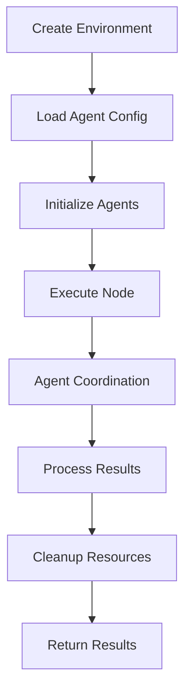

# Environment Framework

> A flexible, extensible framework for implementing pluggable coding challenge environments with strategy-based execution patterns.

The Environment Framework enables creation of specialized environments that can be tailored for different evaluation objectives and agent configurations across coding challenges.

***The current provided environments (`environment_coding_challenge`, `environment_enhanced_coding_challenge`) are focused on coding challenges and LLM agent coordination***.

However, the framework's modular architecture makes it easy to extend for any domain requiring agent-based problem solving and evaluation.

## Quick Start

```python
# 1. Import and setup
from src.environment.base_environment import BaseEnvironment
from src.environment.environment_registry import environment_registry
from src.environment.utils import create_environment

# 2. Load available environments
environment_registry.load_environment_modules()

# 3. Create and run environment
environment = create_environment(
    "environment_coding_challenge", 
    agents=["challenge_designer", "test_generator", "problem_solver", "problem_fixer"]
)
await environment.initialize()

# 4. Execute challenge
results = await environment.execute_node(
    concept="loops",
    difficulty_level="medium",
    max_attempts=3
)
```

## Table of Contents

- [Environment Philosophy](#environment-philosophy)
- [Getting Started](#getting-started)
- [Architecture](#architecture)
- [Built-in Environments](#built-in-environments)
- [Configuration Reference](#configuration-reference)
- [Extending the Framework](#extending-the-framework)
- [API Documentation](#api-documentation)
- [Advanced Usage](#advanced-usage)
- [Guidelines](#guidelines)

## Environment Philosophy

The Environment Framework is built on several key principles:

- **Modularity**: Each environment is completely independent and can be mixed, matched, or replaced without affecting other components.
- **Extensibility**: The decorator-based registry system allows for defining custom behaviors without modifying core framework code.
- **Agent Coordination**: Built-in support for multi-agent workflows with automatic session management.
- **Configuration-Driven**: All environment behaviors can be tuned through external configuration, supporting different experimental setups.
- **Async-First**: Full asynchronous support with intelligent process pooling for efficient concurrent operations.

## Getting Started

### Basic Usage

#### 1. Define Your Environment

Environments are automatically discovered and registered using the decorator pattern:

```python
from src.environment.environment_registry import environment_registry
from typing import TYPE_CHECKING, Dict

if TYPE_CHECKING:
    from src.environment.base_environment import BaseEnvironment

@environment_registry.register_environment_method(
    "my_custom_environment",
    "execute_node"
)
async def execute_node(
    self: "BaseEnvironment", 
    concept: str, 
    difficulty_level: str,
    **kwargs
) -> Dict:
    """Execute a custom challenge environment."""
    # Initialize environment if needed
    if not self._initialized:
        await self.initialize()
    
    # Your custom environment logic here
    problem = await self.agents["designer"].interact(
        concepts=concept,
        difficulty_level=difficulty_level
    )
    
    solution = await self.agents["solver"].interact(
        problem_statement=problem
    )
    
    return {"success": True, "problem": problem, "solution": solution}
```

#### 2. Configure Agent Requirements

Each environment defines its required agents:

```python
# Agent configuration for your environment
required_agents = [
    "designer",      # Problem design agent
    "solver",        # Solution generation agent  
    "validator"      # Solution validation agent
]

# Environment will be created with these agents
environment = create_environment(
    "my_custom_environment",
    agents=required_agents
)
```

#### 3. Execute Your Environment

```python
# Initialize agents and execute
await environment.initialize()

results = await environment.execute_node(
    concept="recursion",
    difficulty_level="hard",
    custom_param="value"
)

print(f"Success: {results['success']}")
await environment.reset()  # Clean up agent sessions
```

## Architecture

### Core Components

```
src/environment/
├── base_environment.py              # Core environment framework
├── environment_registry.py          # Strategy registration system
├── environment_coding_challenge.py  # Standard coding challenge implementation
├── environment_enhanced_coding_challenge.py  # Enhanced challenge implementation
├── utils.py                         # Helper functions
└── __init__.py                      # Module exports
```

### Component Overview

#### BaseEnvironment

The `BaseEnvironment` class provides the core environment functionality:

- **Agent Management**: Automatic initialization and lifecycle management of LLM agents.
- **Process Pool Management**: Shared ProcessPoolExecutor for concurrent script execution.
- **Output Directory Handling**: Temporary directory creation and cleanup for test outputs.
- **Strategy Resolution**: Dynamic method resolution through the environment registry.

#### EnvironmentRegistry

The `EnvironmentRegistry` implements a decorator-based strategy pattern:

- **Automatic Discovery**: Discovers environment modules by scanning for `environment_*.py` files.
- **Strategy Registration**: Register custom implementations using decorators.
- **Runtime Resolution**: Dynamically resolve environment methods at execution time.

#### Environment Interface

Each environment **must** implement the core method:

| Method | Purpose | Async | Description |
|--------|---------|-------|-------------|
| `execute_node` | Challenge Execution | ✅ | Defines the complete execution flow for the environment |

### Execution Flow



## Built-in Environments

The current implementation includes two reference implementations for coding challenges:

### Standard Coding Challenge (`environment_coding_challenge`)

**Objective**: Execute standard coding challenges with basic multi-agent workflow.

**Agent Workflow**:
1. **Challenge Designer**: Generates problem statements based on concepts and difficulty
2. **Test Generator**: Creates comprehensive test cases for the problem
3. **Problem Solver**: Generates solution code with error feedback handling
4. **Problem Fixer**: Attempts to fix failed solutions as a final recovery step

**Strategy Details**:
- **Problem Generation**: Single problem per execution with concept-based generation
- **Solution Attempts**: Up to `max_attempts` iterations with feedback-driven improvement
- **Test Execution**: Concurrent script execution with detailed result tracking
- **Failure Recovery**: Final fix attempt using specialized problem fixer agent
- **Scoring**: Success-based evaluation with attempt and error penalties

**Best For**: Standard evaluation, baseline assessment, single problem validation

### Enhanced Coding Challenge (`environment_enhanced_coding_challenge`)

**Objective**: Execute comprehensive challenges with additional validation and multiple problem support.

**Agent Workflow**:
1. **Advanced Challenge Designer**: Generates diverse problems with duplicate avoidance
2. **Test Generator**: Creates test cases for problems
3. **Test Validator**: Validates test case quality and coverage
4. **Problem Solver**: Generates solutions with enhanced feedback
5. **Problem Fixer**: Fixes failed solutions
6. **Test Error Analyzer**: Provides detailed error analysis and insights

**Strategy Details**:
- **Multi-Problem Support**: Configurable number of problems per execution
- **Enhanced Generation**: Advanced problem generation with variation tracking
- **Test Validation**: Quality assurance for generated test cases
- **Comprehensive Analysis**: Detailed error analysis and reporting
- **Batch Processing**: Efficient handling of multiple problem variations

**Best For**: Comprehensive evaluation, test quality assurance, research data generation

## Configuration Reference

### Environment Parameters

#### Agent Configuration
```python
# Required agents for each environment
environment_agents = {
    "environment_coding_challenge": [
        "challenge_designer",
        "test_generator", 
        "problem_solver",
        "problem_fixer"
    ],
    "environment_enhanced_coding_challenge": [
        "challenge_designer_advanced",
        "test_generator",
        "test_validator", 
        "problem_solver",
        "problem_fixer",
        "test_error_analyzer"
    ]
}
```

#### Execution Parameters

| Parameter | Type | Default | Description |
|-----------|------|---------|-------------|
| `concept` | str/List[str] | Required | Programming concept(s) to test |
| `difficulty_level` | str | Required | Difficulty level (easy, medium, hard, etc.) |
| `max_attempts` | int | 3 | Maximum solution attempts per problem |
| `num_problems` | int | 1 | Number of problems (enhanced environment only) |

#### Environment Variables

| Variable | Description | Default |
|----------|-------------|---------|
| `LLM_SERVICE_URL` | URL of the LLM interface service | `http://llm-interface:8000` |
| `ENV_OUTPUT_DIR` | Directory for temporary test outputs | `/app/env_outputs` |

## Extending the Framework

### Creating Custom Environments

#### Step 1: Environment Implementation

Create a new module following the naming convention:

```python
# environment_custom_evaluation.py
from typing import TYPE_CHECKING, Dict
from loguru import logger
from src.environment.environment_registry import environment_registry

if TYPE_CHECKING:
    from src.environment.base_environment import BaseEnvironment

@environment_registry.register_environment_method(
    "environment_custom_evaluation",
    "execute_node"
)
async def execute_node(
    self: "BaseEnvironment",
    concept: str,
    difficulty_level: str,
    evaluation_criteria: str = "standard",
    **kwargs
) -> Dict:
    """Custom evaluation environment with specialized criteria."""
    
    # Initialize if needed
    if not self._initialized:
        await self.initialize()
    
    # Custom multi-agent workflow
    requirements = await self.agents["requirements_analyzer"].interact(
        concept=concept,
        difficulty=difficulty_level,
        criteria=evaluation_criteria
    )
    
    problem = await self.agents["problem_designer"].interact(
        requirements=requirements
    )
    
    evaluation = await self.agents["evaluator"].interact(
        problem=problem,
        criteria=evaluation_criteria
    )
    
    return {
        "success": True,
        "requirements": requirements,
        "problem": problem, 
        "evaluation": evaluation,
        "criteria_met": evaluation.get("criteria_satisfied", False)
    }
```

#### Step 2: Agent Coordination Patterns

```python
@environment_registry.register_environment_method(
    "environment_peer_review",
    "execute_node" 
)
async def execute_node(self: "BaseEnvironment", **kwargs) -> Dict:
    """Peer review environment with multiple reviewer agents."""
    
    # Generate initial solution
    solution = await self.agents["primary_solver"].interact(**kwargs)
    
    # Parallel peer review
    reviews = await asyncio.gather(
        self.agents["reviewer_1"].interact(solution=solution),
        self.agents["reviewer_2"].interact(solution=solution),
        self.agents["reviewer_3"].interact(solution=solution)
    )
    
    # Consensus building
    consensus = await self.agents["consensus_builder"].interact(
        solution=solution,
        reviews=reviews
    )
    
    return {
        "success": True,
        "solution": solution,
        "reviews": reviews,
        "consensus": consensus
    }
```

#### Step 3: Error Handling and Recovery

```python
@environment_registry.register_environment_method(
    "environment_robust_execution",
    "execute_node"
)
async def execute_node(self: "BaseEnvironment", **kwargs) -> Dict:
    """Robust environment with comprehensive error handling."""
    
    results = {"attempts": [], "success": False}
    
    for attempt in range(self.max_attempts):
        try:
            # Attempt execution
            result = await self._execute_attempt(attempt, **kwargs)
            results["attempts"].append(result)
            
            if result.get("success"):
                results["success"] = True
                break
                
        except Exception as e:
            logger.error(f"Attempt {attempt} failed: {e}")
            
            # Try recovery
            recovery_result = await self._attempt_recovery(e, attempt, **kwargs)
            results["attempts"].append(recovery_result)
            
            if recovery_result.get("success"):
                results["success"] = True
                break
    
    return results

async def _execute_attempt(self: "BaseEnvironment", attempt: int, **kwargs) -> Dict:
    """Execute a single attempt with error handling."""
    # Implementation here
    pass

async def _attempt_recovery(self: "BaseEnvironment", error: Exception, attempt: int, **kwargs) -> Dict:
    """Attempt to recover from an error.""" 
    # Implementation here
    pass
```

### Advanced Customization

#### Custom Agent Interaction Patterns

```python
# Sequential agent coordination
async def sequential_workflow(self: "BaseEnvironment", **kwargs) -> Dict:
    result = kwargs
    for agent_name in ["analyzer", "designer", "implementer", "tester"]:
        result = await self.agents[agent_name].interact(**result)
    return result

# Conditional agent routing
async def conditional_workflow(self: "BaseEnvironment", **kwargs) -> Dict:
    analysis = await self.agents["analyzer"].interact(**kwargs)
    
    if analysis.get("complexity") == "high":
        return await self.agents["expert_solver"].interact(**kwargs)
    else:
        return await self.agents["standard_solver"].interact(**kwargs)
```

## API Documentation

### BaseEnvironment Class

#### Constructor
```python
BaseEnvironment(
    environment_name: str,
    agents: List[str],
    **kwargs
)
```

#### Key Methods
```python
async def initialize(self) -> None:
    """Initialize all agents asynchronously."""

async def execute_node(self, **kwargs) -> Dict:
    """Execute the environment's main logic."""

async def reset(self) -> None:
    """Clear agent memory and reset sessions."""

def __del__(self) -> None:
    """Cleanup resources on destruction."""
```

### EnvironmentRegistry Class

#### Registration Methods
```python
def register_environment_method(self, environment_name: str, method_name: str) -> Callable:
    """Decorator for registering environment methods."""

def get_environment_method(self, environment_name: str, method_name: str) -> Optional[Callable]:
    """Retrieve a registered environment method."""

def list_environments(self) -> Dict[str, list]:
    """List all registered environments and their methods."""
```

#### Discovery Methods
```python
def discover_environments(self, environments_directory: Optional[str] = None) -> List[str]:
    """Discover all environment modules in the directory."""

def load_environment_modules(self, environments_directory: Optional[str] = None) -> List[str]:
    """Automatically import all discovered environment modules."""
```

### Utility Functions

```python
def create_environment(environment_name: str, **kwargs) -> BaseEnvironment:
    """Factory function for creating configured environment instances."""
```

## Advanced Usage

### Multi-Environment Comparison

```python
async def compare_environments():
    """Compare results across different environments."""
    
    environments = [
        "environment_coding_challenge",
        "environment_enhanced_coding_challenge",
        "environment_custom_evaluation"
    ]
    
    results = {}
    for env_name in environments:
        env = create_environment(env_name, agents=get_required_agents(env_name))
        await env.initialize()
        
        result = await env.execute_node(
            concept="algorithms",
            difficulty_level="hard"
        )
        
        results[env_name] = result
        await env.reset()
    
    return analyze_comparative_results(results)
```

### Dynamic Environment Selection

```python
async def dynamic_environment_selection(problem_characteristics: Dict):
    """Select environment based on problem characteristics."""
    
    if problem_characteristics.get("complexity") == "high":
        env_name = "environment_enhanced_coding_challenge" 
    elif problem_characteristics.get("requires_validation"):
        env_name = "environment_validation_focused"
    else:
        env_name = "environment_coding_challenge"
    
    return await execute_with_environment(env_name, problem_characteristics)
```

### Custom Result Processing

```python
async def process_environment_results(environment_name: str, **kwargs):
    """Execute environment with custom result processing."""
    
    env = create_environment(environment_name, **kwargs)
    await env.initialize()
    
    try:
        raw_results = await env.execute_node(**kwargs)
        
        # Custom processing pipeline
        processed_results = {
            "raw": raw_results,
            "metrics": calculate_metrics(raw_results),
            "insights": extract_insights(raw_results),
            "recommendations": generate_recommendations(raw_results)
        }
        
        return processed_results
        
    finally:
        await env.reset()
```

## Guidelines

- **Naming Convention**: Environment modules must start with `environment_` prefix.
- **Registration**: Always use `@environment_registry.register_environment_method()` decorator.
