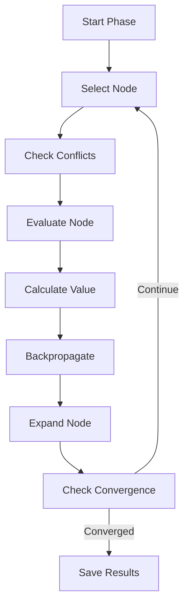

# Multi-Phase Monte Carlo Tree Search

> A flexible, extensible framework for implementing multi-objective Monte Carlo Tree Search with pluggable phase strategies.

The Multi-Phase MCTS framework enables allows creation of search algorithms that can optimize for different objectives across multiple phases.

***The current provided phases (`phase_1`, `phase_2`, `phase_3`) are focused on coding challenges and evaluating the model's capability on solving CS challenges***.

However, the framework's modular architecture makes it easy for any domain requiring multi-objective tree search.

## Quick Start

```python
# 1. Import and setup
# to interace with the environment service
from src.environment_client import EnvironmentClient 
# to create a phase
from src.mcts.utils import create_phase
# to use a registered phase
from src.mcts.phase_registry import phase_registry
# to define the tree
from src.tree import Tree 

# 2. Initialize tree
tree = Tree(concepts=["loops", "functions"], difficulties=["easy", "medium", "hard"])
tree.initialize_tree()

# load the defined modules for each phase
phase_registry.load_phase_modules()

# 3. Create and run phase
phase = create_phase("phase_1", tree, environment, config)
await phase.run()
```

## Table of Contents

- [Multi-Phase Search Philosophy](#multi-phase-search-philosophy)
- [Getting Started](#getting-started)
- [Architecture](#architecture)
- [Built-in Phases](#built-in-phases)
- [Configuration Reference](#configuration-reference)
- [Extending the Framework and Introducing New Phases](#extending-the-framework-and-introducing-new-phases)
- [API Documentation](#api-documentation)
- [Advanced Usage](#advanced-usage)
- [Guidelines](#guidelines)

## Multi-Phase Search Philosophy

The Multi-Phase MCTS is built on several key principles:

- **Modularity**: Each phase is completely independent and can be mixed, matched, or replaced without affecting other components.
- **Extensibility**: The decorator-based strategy system allows for defining custom behaviors without modifying core framework code.
- **Concurrency**: Built-in async support with intelligent conflict detection enables efficient parallel evaluation.
- **Configuration-Driven**: All phase behaviors can be tuned through external configuration files, supporting different experimental setups.
- **Multi-Objective**: Different phases can optimize for completely different objectives using the same underlying tree structure.

## Getting Started

### Basic Usage

#### 1. Define Your Domain

Create a tree structure representing your problem space:

```python
from src.tree import Tree

# Define concepts and difficulty levels for your domain
tree = Tree(
    concepts=["concept1", "concept2", "concept3"],
    difficulties=["easy", "medium", "hard", "very_hard"]
)
tree.initialize_tree()
```
For more information about the tree structure and creating custom trees, see [Tree Structure](../tree/README.md).

#### 2. Configure Your Phase

Each phase, requires 2 YAML configuration files:

##### Phase Configurations:
Contains the configurations for each defined phase. Each phase requires 4 categories of configurations:

- Phase params: phase specific parameters
```yaml
max_depth: 5 # maximum depth of the tree in this phase.
max_iterations: 100 # maximum amount of iterations in this phase
performance_threshold: 0.4 # performance threshold for selecting nodes
value_delta_threshold: 0.3 # performance threshold for considering node value convergence
convergence_checks: 10 # number of times convergence checks need to return positive for a phase to be terminated
exploration_probability: 0.25 # epsilon value for random node selection
num_nodes_per_iteration: 5 # number of nodes to generate at each iteration once the node is selected
```

- Search params: Search specific parameters
```yaml
max_attempts: 3 # maximum number of times a node can be retried ebfore being considered a failure
discount_factor: 0.9 # discount factor for backpropagation of results
learning_rate: 0.9 # the ratio of new node values' score to the old node values' score. 1 means no consideration of old values
```

- Scoring params: Node value scoring parameters:
```yaml
penalty_per_failure: 2 # weight for failures
penalty_per_error: 3 # weight for errors
penalty_per_attempt: 1 # weight for retries
fixed_by_problem_fixer_penalty: 5 # weight for using the problem fixer agent
```

- Environment:
```yaml
name: 'environment_coding_challenge' # name of the environment to use
```

##### Experiment Configurations:
Contains the configurations for a single experiments run.
```yaml
name: "default" # name of the experiment
description: "Default experiment configuration" # description of the experiment

phase_sequences: # order of running the phases
  - phase_1
  - phase_2
  - phase_3
```

#### 3. Run a Phase

```python
from src.environment_client import EnvironmentClient
from src.mcts.utils import create_phase
from src.mcts.phase_registry import phase_registry
from src.tree import Tree

# Load all phase modules to register their strategies
phase_registry.load_phase_modules()

phase_one = create_phase(
            phase_name="phase_1",
            tree=tree,
            environment=environment,
        )

await phase_one.run()
```

## Architecture

### Core Components

```
src/mcts/
├── base_phase.py          # Core MCTS framework
├── phase_registry.py      # Strategy registration system
├── phase_1.py            # Capability mapping phase implementation
├── phase_2.py            # Challenge discovery phase implementation  
├── phase_3.py            # Comprehensive evaluation phase implementation
├── utils.py              # Helper functions
└── __init__.py           # Module exports
```

### Component Overview

#### BasePhase

The `BasePhase` class provides the core search functionality:

- **Async Task Management**: Concurrent node evaluation with conflict detection.
- **Configuration Handling**: Automatic parameter loading with sensible defaults.
- **Tree Operations**: Node selection, evaluation, expansion, and backpropagation.
- **Progress Tracking**: Built-in logging, visualization, and state persistence.

#### PhaseRegistry

The `PhaseRegistry` implements a decorator-based strategy pattern:

- **Strategy Registration**: Register custom implementations using decorators.
- **Runtime Resolution**: Dynamically resolve strategy methods at execution time.

#### Strategy Interface

Each phase **must** implement five core strategy methods:

| Method | Purpose | Async | Description |
|--------|---------|-------|-------------|
| `select_node` | Node Selection | ✅ | Defines the strategy to be used for selecting nodes for evaluation |
| `evaluate_node` | Node Evaluation | ✅ | Defines the strategy for how a node should be evaluated |
| `calculate_node_value` | Scoring | ❌ | Defines how evaluation results are to be converted to numeric scores |
| `backpropagate_node_value` | Value Propagation | ❌ | Defines how the node values should be backpropagated up the tree |
| `expand_node` | Tree Expansion | ✅ | Defines how nodes should be expanded |

### Execution Flow



## Built-in Phases

The current implementation includes three reference implementations demonstrating different search objectives:

### Phase 1: Capability Mapping (`phase_1`)

**Objective**: Broad exploration of the concept space to identify promising areas.

**Strategy Details**:
- **Selection**: Probability-weighted selection favoring higher-value nodes with ε-greedy exploration.
- **Evaluation**: Standard domain evaluation without enhancements.
- **Scoring**: Success-based scoring with difficulty multipliers and failure penalties.
- **Expansion**: Concept combination or difficulty progression based on performance thresholds.
- **Backpropagation**: Exponential decay with configurable discount factor.

**Best For**: Initial exploration, search space traversal, baseline establishment

### Phase 2: Challenge Discovery (`phase_2`) 

**Objective**: Identify challenging areas by inverting the scoring mechanism and selecting nodes that consistently underperform.

**Strategy Details**:
- **Selection**: Same probability-based selection as Phase 1 (different ε).
- **Evaluation**: Standard domain evaluation.
- **Scoring**: **Inverted scoring** - higher values for more challenging problems.
- **Expansion**: Creates Phase 2 nodes, focusing on challenging combinations.
- **Backpropagation**: Same decay mechanism as Phase 1.

**Best For**: Difficulty assessment, challenge identification, stress testing.

### Phase 3: Comprehensive Evaluation (`phase_3`)

**Objective**: Generate diverse variations of the most challenging problems identified in Phase 2.

**Strategy Details**:
- **Selection**: Restricted to Phase 2 nodes above configurable threshold.
- **Evaluation**: **Enhanced mode** with multiple variations per evaluation.
- **Scoring**: Challenge-based scoring consistent with Phase 2.
- **Expansion**: Creates Phase 3 nodes with varied implementations of same concepts.
- **Backpropagation**: Consistent with previous phases.

**Best For**: Variation generation, comprehensive evaluation, dataset creation.

## Configuration Reference

### Phase Parameters

| Parameter | Type | Default | Description |
|-----------|------|---------|-------------|
| `max_depth` | int | 5 | Maximum tree depth to prevent infinite expansion |
| `max_iterations` | int | 100 | Maximum iterations before forced termination |
| `performance_threshold` | float | 0.4 | Minimum node value required for expansion |
| `value_delta_threshold` | float | 0.3 | Convergence threshold for value changes |
| `convergence_checks` | int | 5 | Consecutive iterations without change before convergence |
| `exploration_probability` | float | 0.2 | Probability of random exploration vs. exploitation |
| `num_nodes_per_iteration` | int | 5 | Number of concurrent node evaluations |
| `node_selection_threshold` | float | 0.5 | Phase 3 minimum value for node selection |
| `variations_per_concept` | int | 3 | Phase 3 variations to generate per concept |

### Search Parameters

| Parameter | Type | Default | Description |
|-----------|------|---------|-------------|
| `max_attempts` | int | 3 | Maximum evaluation attempts per node |
| `discount_factor` | float | 0.9 | Backpropagation decay factor |
| `learning_rate` | float | 0.9 | Value update learning rate |

### Scoring Parameters

| Parameter | Type | Default | Description |
|-----------|------|---------|-------------|
| `penalty_per_failure` | int | 2 | Score penalty for each test failure |
| `penalty_per_error` | int | 3 | Score penalty for each execution error |
| `penalty_per_attempt` | int | 1 | Score penalty for additional attempts |
| `fixed_by_problem_fixer_penalty` | int | 5 | Penalty when automatic fixing is required |

## Extending the Framework and Introducing New Phases

### Creating Custom Phases

#### Step 1: Strategy Implementation

Create a new module for your custom phase:

```python
# my_custom_phase.py
from typing import TYPE_CHECKING, Dict
from loguru import logger
from src.mcts.phase_registry import phase_registry
from src.tree import ChallengeNode

if TYPE_CHECKING:
    from src.mcts.base_phase import BasePhase

@phase_registry.register_strategy("my_strategy", "select_node")
async def select_node(self: "BasePhase") -> ChallengeNode:
    """Custom node selection logic."""
    # Implement your selection strategy
    nodes_by_priority = sorted(self.tree.nodes, key=your_priority_function)
    return nodes_by_priority[0]

@phase_registry.register_strategy("my_strategy", "evaluate_node")
async def evaluate_node(self: "BasePhase", node: ChallengeNode) -> Dict:
    """Custom evaluation logic."""
    # Implement your evaluation strategy
    results = await self.environment.custom_evaluation(node)
    return results

@phase_registry.register_strategy("my_strategy", "calculate_node_value")
def calculate_node_value(self: "BasePhase", results: Dict, **kwargs) -> float:
    """Custom scoring logic."""
    # Implement your scoring strategy
    return custom_score_calculation(results)

@phase_registry.register_strategy("my_strategy", "backpropagate_node_value")
def backpropagate_node_value(self: "BasePhase", node: ChallengeNode, reward: float) -> None:
    """Custom backpropagation logic."""
    # Implement your backpropagation strategy
    custom_value_update(node, reward, self.search_params.learning_rate)

@phase_registry.register_strategy("my_strategy", "expand_node")
async def expand_node(self: "BasePhase", node: ChallengeNode) -> None:
    """Custom expansion logic."""
    # Implement your expansion strategy
    if meets_expansion_criteria(node):
        new_node = self.tree.add_node([node], **custom_parameters)
        await self.evaluate_node(new_node)
```

#### Step 2: Registration and Usage

```python
# Import your phase to register strategies
import my_custom_phase
# Import tree and environment client
from src.tree import Tree
from src.environment_client import EnvironmentClient

# Use your custom phase
phase = create_phase(
    strategy_name="my_strategy",
    tree=tree,
    environment=environment,
    config=config
)

await phase.run()
```

### Advanced Customization

#### Custom Configuration Parameters

Add custom parameters to your configuration:

```yaml
# config.yml
phase_params:
  # Standard parameters
  max_depth: 5
  # Your custom parameters
  custom_threshold: 0.7
  custom_weight: 2.5
```

Access them in your strategies:

```python
@phase_registry.register_strategy("my_strategy", "select_node")
async def select_node(self: "BasePhase") -> ChallengeNode:
    custom_threshold = getattr(self.phase_params, 'custom_threshold', 0.5)
    # Use custom_threshold in your logic
```

#### Environment Integration

Integrate with custom environments:

```python
@phase_registry.register_strategy("my_strategy", "evaluate_node")
async def evaluate_node(self: "BasePhase", node: ChallengeNode) -> Dict:
    # Check environment capabilities
    if hasattr(self.environment, 'custom_method'):
        return await self.environment.custom_method(node, **custom_params)
    else:
        return await self.environment.run_challenge(node.concepts, node.difficulty)
```

## API Documentation

### BasePhase Class

#### Constructor

```python
BasePhase(
    phase_name: str
    tree: Tree,
    environment: Union[EnvironmentClient, EnhancedEnvironmentClient],
    config: dict,
)
```

**Parameters**:
- `phase_name`: name of the defined phase. must be the same in `phase_configs.yaml` and `experiment_configs.yaml`.
- `tree`: Tree instance containing the search space
- `environment`: Environment client for node evaluation
- `config`: Configuration dictionary with phase, search, and scoring parameters

**NOTE**: This construcor has no implemented functions for node selection, evluation, scoring, and explansion. These functionalities are implemented in phase definitions.

#### Key Methods

```python
async def run() -> None:
    """Execute the MCTS algorithm until convergence or termination."""

def save_progress(self, path: str, iteration: str) -> None:
    """Save current tree state and visualization."""

def _get_strategy_method(self, method_name: str) -> Callable:
    """Retrieve registered strategy method."""
```

### PhaseRegistry Class

#### Methods

```python
def register_strategy(self, strategy_name: str, method_name: str) -> Callable:
    """Decorator for registering strategy methods."""

def get_strategy(self, strategy_name: str, method_name: str) -> Optional[Callable]:
    """Retrieve a registered strategy method."""

def list_strategies(self) -> Dict[str, list]:
    """List all registered strategies and their methods."""
```

### Utility Functions

```python
def create_phase(
    strategy_name: str,
    tree: Tree,
    environment: EnvironmentClient,
    config: dict,
    **kwargs
) -> BasePhase:
    """Factory function for creating configured phase instances."""
```

## Advanced Usage

### Multi-Phase Workflows

Chain multiple phases for complex objectives:

```python
async def multi_phase_workflow():
    # Phase 1: Exploration
    exploration_phase = create_phase("temp_phase_1", tree, env, config)
    await exploration_phase.run()
    
    # Phase 2: Assessment 
    assessment_phase = create_phase("temp_phase_2", tree, env, config)
    await assessment_phase.run()
    
    # Phase 3: Enhancement
    enhancement_phase = create_phase("temp_phase_3", tree, env, config) 
    await enhancement_phase.run()
    
    return tree
```

### Custom Convergence Criteria

Implement domain-specific convergence:

```python
@phase_registry.register_strategy("converge_on_target", "select_node")
async def select_node(self: "BasePhase") -> ChallengeNode:
    # Check custom convergence criteria
    if custom_convergence_check(self.tree):
        self.convergence = True
        logger.info("Custom convergence criteria met")
    
    return standard_selection_logic(self)
```

### Dynamic Configuration

Update configuration during execution:

```python
@phase_registry.register_strategy("adaptive", "evaluate_node") 
async def evaluate_node(self: "BasePhase", node: ChallengeNode) -> Dict:
    # Adapt configuration based on performance
    if average_performance(self.tree) < threshold:
        self.phase_params.exploration_probability *= 1.1
        logger.info("Increased exploration due to low performance")
    
    return await standard_evaluation(self, node)
```

## Guidelines

- **Strategy Naming**: Use descriptive names that clearly indicate the phase's objective. Each phase's script name **MUST** being with `phase_`.
- **Documentation**: Include docstrings with examples for all public methods.
